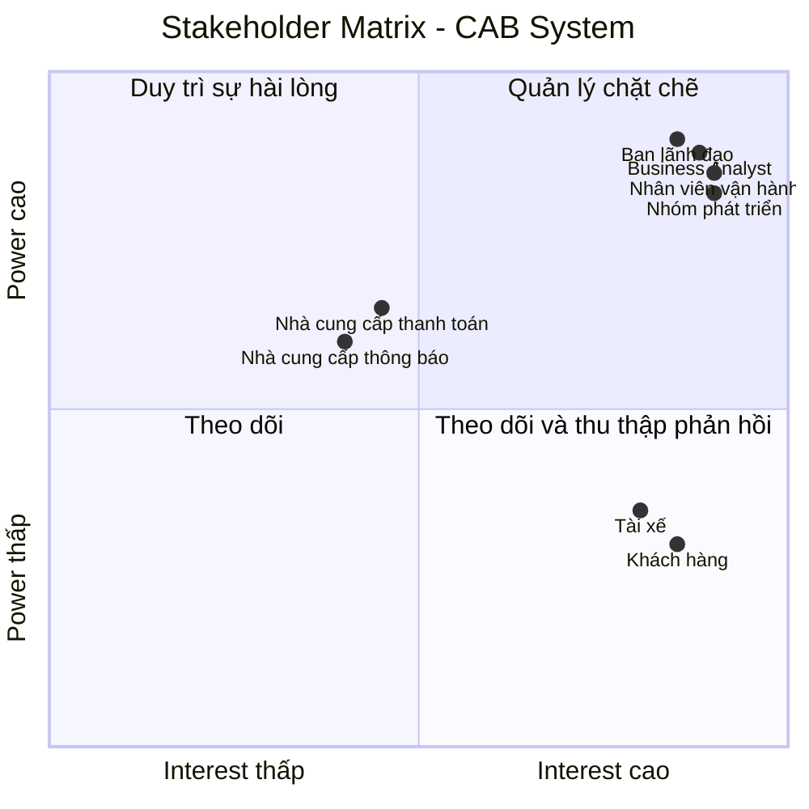
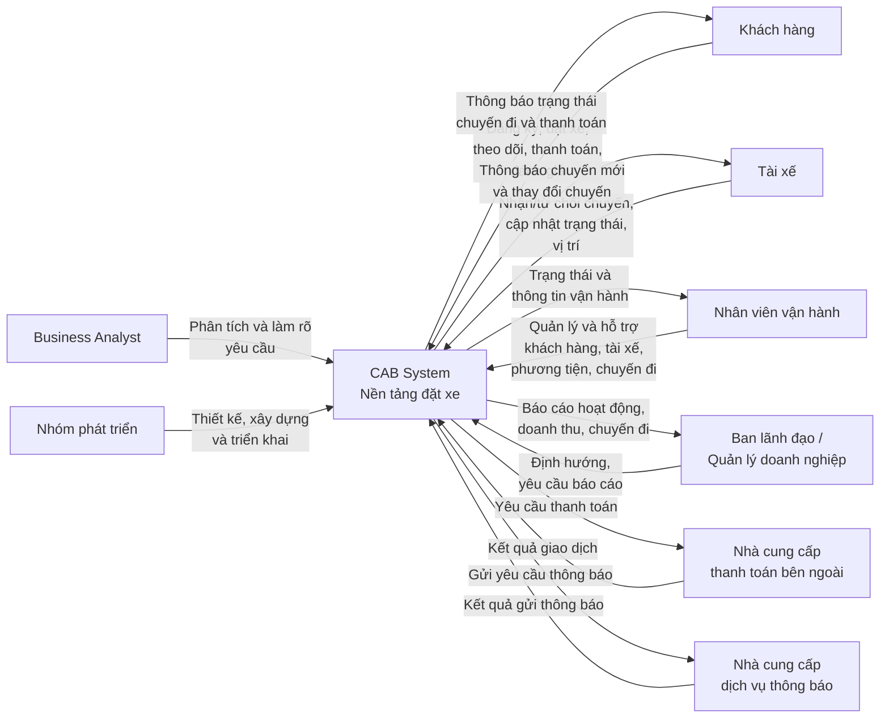

## 3. Stakeholder Identification

### 3.1. Danh sách Stakeholder

| STT | Stakeholder                         | Vai trò                                                                                                                                                                  |
| --- | ----------------------------------- | ------------------------------------------------------------------------------------------------------------------------------------------------------------------------ |
| 1   | Khách hàng                          | Người sử dụng hệ thống để đăng ký, đặt xe, theo dõi chuyến đi, thanh toán, xem lịch sử và đánh giá tài xế.                                                               |
| 2   | Tài xế                              | Người nhận và thực hiện chuyến xe; cập nhật trạng thái chuyến đi, thông tin phương tiện và trạng thái hoạt động.                                                         |
| 3   | Nhân viên vận hành                  | Quản lý khách hàng, tài xế, phương tiện và chuyến đi; theo dõi chuyến đang diễn ra và hỗ trợ xử lý các trường hợp phát sinh.                                             |
| 4   | Ban lãnh đạo / Quản lý doanh nghiệp | Định hướng hoạt động của hệ thống, theo dõi báo cáo về số lượng chuyến, doanh thu, tỷ lệ hoàn thành, tỷ lệ hủy và hiệu quả tài xế.                                       |
| 5   | Nhà cung cấp thanh toán bên ngoài   | Cung cấp dịch vụ xử lý thanh toán điện tử cho hệ thống CAB.                                                                                                              |
| 6   | Nhà cung cấp dịch vụ thông báo      | Cung cấp các kênh gửi thông báo cho khách hàng và tài xế; có thể được mở rộng hoặc thay thế trong tương lai.                                                             |
| 7   | Business Analyst (BA)               | Làm rõ các yêu cầu chưa được chốt với các bên liên quan và xác định phạm vi, tác nhân, quy trình nghiệp vụ, yêu cầu chức năng, phi chức năng và các trường hợp ngoại lệ. |
| 8   | Nhóm phát triển hệ thống            | Phân tích, thiết kế, xây dựng và triển khai nền tảng CAB dựa trên các yêu cầu đã được xác định.                                                                          |

### 3.2. Vai trò và mức độ quan tâm của Stakeholder

| Stakeholder                         | Quyền lực (Power) | Mức độ quan tâm (Interest) | Mức độ ưu tiên | Chiến lược quản lý                                                   |
| ----------------------------------- | ----------------- | -------------------------- | -------------- | -------------------------------------------------------------------- |
| Ban lãnh đạo / Quản lý doanh nghiệp | Cao               | Cao                        | Rất cao        | Quản lý chặt chẽ, thường xuyên cập nhật và lấy ý kiến                |
| Nhân viên vận hành                  | Cao               | Cao                        | Rất cao        | Tham gia thường xuyên, lấy phản hồi trong quá trình phân tích        |
| Khách hàng                          | Thấp              | Cao                        | Cao            | Theo dõi nhu cầu và đảm bảo hệ thống đáp ứng trải nghiệm sử dụng     |
| Tài xế                              | Thấp              | Cao                        | Cao            | Thường xuyên thu thập phản hồi về quy trình nhận và thực hiện chuyến |
| Nhà cung cấp thanh toán bên ngoài   | Trung bình        | Trung bình                 | Trung bình     | Phối hợp và theo dõi việc tích hợp                                   |
| Nhà cung cấp dịch vụ thông báo      | Trung bình        | Trung bình                 | Trung bình     | Phối hợp về giao tiếp và khả năng mở rộng kênh thông báo             |
| Business Analyst (BA)               | Cao               | Cao                        | Rất cao        | Phối hợp chặt chẽ với các stakeholder để làm rõ yêu cầu              |
| Nhóm phát triển hệ thống            | Cao               | Cao                        | Rất cao        | Phối hợp chặt chẽ trong quá trình thiết kế và triển khai             |

---

## 3.3. Stakeholder Matrix

Stakeholder Matrix được phân loại dựa trên hai tiêu chí: **Power (Quyền lực)** và **Interest (Mức độ quan tâm)**.

|                | **Interest thấp**                                                 | **Interest cao**                                                                                    |
| -------------- | ----------------------------------------------------------------- | --------------------------------------------------------------------------------------------------- |
| **Power cao**  | Nhà cung cấp thanh toán bên ngoài, Nhà cung cấp dịch vụ thông báo | Ban lãnh đạo / Quản lý doanh nghiệp, Nhân viên vận hành, Business Analyst, Nhóm phát triển hệ thống |
| **Power thấp** | —                                                                 | Khách hàng, Tài xế                                                                                  |

### Chiến lược theo Stakeholder Matrix

* **Power cao – Interest cao:** Quản lý chặt chẽ. Đây là nhóm cần được tham gia thường xuyên vì có khả năng quyết định hoặc ảnh hưởng lớn đến hệ thống.
* **Power cao – Interest thấp:** Duy trì sự hài lòng và phối hợp khi cần thiết, đặc biệt đối với các bên cung cấp dịch vụ bên ngoài.
* **Power thấp – Interest cao:** Theo dõi và thu thập phản hồi thường xuyên vì đây là những người trực tiếp sử dụng hoặc chịu ảnh hưởng bởi hệ thống.
* **Power thấp – Interest thấp:** Không có stakeholder chính thuộc nhóm này trong phạm vi yêu cầu hiện tại.

---

## 3.4. Mermaid – Stakeholder Matrix

## 3.5. Mermaid – Sơ đồ Stakeholder và CAB System

## 4. Business Goals

### BG-01 – Nâng cao chất lượng dịch vụ đặt xe

**Business Goal:**
Xây dựng một nền tảng CAB giúp khách hàng thực hiện toàn bộ quy trình đặt xe thuận tiện, từ tạo yêu cầu, tìm tài xế, theo dõi chuyến đi, thanh toán đến đánh giá sau chuyến.

**Mục tiêu:**

* Giảm những hạn chế của hệ thống đặt xe hiện tại.
* Cải thiện trải nghiệm của khách hàng trong quá trình đặt và sử dụng dịch vụ.
* Cung cấp thông tin rõ ràng về trạng thái chuyến đi cho khách hàng.

---

### BG-02 – Nâng cao hiệu quả phân công tài xế

**Business Goal:**
Tự động hóa và cải thiện quá trình tìm kiếm, lựa chọn và phân công tài xế phù hợp cho mỗi yêu cầu đặt xe.

**Mục tiêu:**

* Ưu tiên tài xế phù hợp và ở gần khách hàng.
* Giảm sự phụ thuộc vào việc phân công thủ công.
* Có khả năng tiếp tục tìm tài xế khác khi tài xế được đề xuất không phản hồi hoặc từ chối chuyến.
* Hạn chế trường hợp khách hàng phải tạo lại yêu cầu khi việc phân công tài xế thất bại.

## Yêu cầu này xuất phát trực tiếp từ vấn đề hiện tại của doanh nghiệp về việc phân công tài xế chủ yếu được thực hiện thủ công và yêu cầu xây dựng cơ chế tìm tài xế phù hợp.

### BG-03 – Nâng cao hiệu quả quản lý và vận hành

**Business Goal:**
Tập trung hóa hoạt động quản lý khách hàng, tài xế, phương tiện và chuyến đi nhằm giúp bộ phận vận hành theo dõi và xử lý hoạt động kinh doanh hiệu quả hơn.

**Mục tiêu:**

* Hỗ trợ nhân viên vận hành theo dõi các chuyến đang diễn ra.
* Kiểm tra trạng thái hoạt động của tài xế.
* Hỗ trợ xử lý các trường hợp chuyến đi bị lỗi.
* Tra cứu lịch sử giao dịch.
* Phân quyền các thao tác quản trị theo vai trò.

Các mục tiêu này bám theo yêu cầu quản trị và vận hành được nêu trong tài liệu.

---

### BG-04 – Quản lý doanh thu và thanh toán hiệu quả

**Business Goal:**
Xây dựng quy trình tính cước và thanh toán tập trung, chính xác và có khả năng tích hợp với các dịch vụ thanh toán điện tử bên ngoài.

**Mục tiêu:**

* Xác định chính xác số tiền khách hàng cần thanh toán sau chuyến đi.
* Hỗ trợ cả thanh toán tiền mặt và thanh toán điện tử.
* Giảm rủi ro khi quản lý thông tin thanh toán nhạy cảm.
* Có khả năng xử lý lại giao dịch khi thanh toán điện tử thất bại.
* Cung cấp dữ liệu phục vụ theo dõi doanh thu.

Tài liệu yêu cầu doanh nghiệp tích hợp nhà cung cấp thanh toán bên ngoài nhưng không lưu trực tiếp thông tin nhạy cảm của thẻ hoặc tài khoản thanh toán trong hệ thống CAB.

---

### BG-05 – Cải thiện khả năng theo dõi và giao tiếp với khách hàng, tài xế

**Business Goal:**
Cung cấp thông tin kịp thời cho khách hàng và tài xế trong suốt quá trình sử dụng dịch vụ.

**Mục tiêu:**

* Thông báo cho khách hàng về trạng thái yêu cầu và chuyến đi.
* Thông báo khi tài xế nhận chuyến và khi tài xế đến điểm đón.
* Thông báo kết quả thanh toán.
* Thông báo cho tài xế về chuyến mới và các thay đổi liên quan đến chuyến đang thực hiện.
* Cho phép mở rộng thêm các kênh thông báo trong tương lai.

Các yêu cầu này được nêu rõ trong phần thông báo của tài liệu.

---

### BG-06 – Đảm bảo hệ thống hoạt động ổn định và có khả năng mở rộng

**Business Goal:**
Xây dựng nền tảng CAB có khả năng đáp ứng nhu cầu tăng cao và phát triển lâu dài mà không ảnh hưởng lớn đến các chức năng đang hoạt động.

**Mục tiêu:**

* Duy trì hoạt động ổn định khi nhu cầu sử dụng tăng cao.
* Cho phép các thành phần của hệ thống mở rộng độc lập khi tải tăng.
* Cho phép triển khai từng phần các chức năng mới.
* Hạn chế ảnh hưởng của lỗi ở một thành phần đến toàn bộ hệ thống.
* Tạo nền tảng có thể phục vụ số lượng lớn khách hàng và tài xế.

Đây là một trong những kỳ vọng quan trọng của doanh nghiệp đối với nền tảng CAB mới.

---

### BG-07 – Đảm bảo an toàn và bảo mật dữ liệu

**Business Goal:**
Bảo vệ thông tin người dùng, dữ liệu vận hành và dữ liệu giao dịch trong quá trình hệ thống hoạt động.

**Mục tiêu:**

* Đảm bảo khách hàng và tài xế được xác thực trước khi sử dụng các chức năng yêu cầu tài khoản.
* Kiểm soát quyền truy cập đối với các thao tác quản trị.
* Bảo vệ thông tin cá nhân, thông tin phương tiện, dữ liệu vị trí và dữ liệu giao dịch.
* Lưu vết các thao tác quan trọng để hỗ trợ kiểm tra và xử lý sự cố.

Các mục tiêu này được xác định trực tiếp từ yêu cầu bảo mật của doanh nghiệp.

---

### BG-08 – Hỗ trợ ra quyết định và đánh giá hiệu quả kinh doanh

**Business Goal:**
Cung cấp dữ liệu và báo cáo cần thiết để ban lãnh đạo theo dõi tình hình hoạt động và đánh giá hiệu quả kinh doanh của dịch vụ đặt xe.

**Mục tiêu:**

* Theo dõi số lượng chuyến.
* Theo dõi doanh thu.
* Theo dõi tỷ lệ chuyến hoàn thành.
* Theo dõi tỷ lệ hủy chuyến.
* Đánh giá hiệu quả hoạt động của tài xế.

Ban lãnh đạo được kỳ vọng có báo cáo về các chỉ số hoạt động này.

---

### BG-09 – Tạo nền tảng linh hoạt cho phát triển trong tương lai

**Business Goal:**
Xây dựng nền tảng CAB có khả năng thích ứng với các nhu cầu kinh doanh mới mà không phải xây dựng lại toàn bộ hệ thống.

**Mục tiêu:**

* Có thể bổ sung các loại dịch vụ mới.
* Có thể thêm các phương thức thanh toán mới.
* Có thể tích hợp thêm các nhà cung cấp dịch vụ thông báo.
* Có thể thay đổi một số thành phần kỹ thuật khi cần.
* Hỗ trợ doanh nghiệp phát triển hệ thống trong dài hạn.

Mục tiêu này phù hợp với kỳ vọng của doanh nghiệp về một nền tảng CAB có thể phát triển lâu dài và linh hoạt mở rộng.

---

## 4.1. Business Goals Summary

| ID    | Business Goal                             | Mục đích chính                           |
| ----- | ----------------------------------------- | ---------------------------------------- |
| BG-01 | Nâng cao chất lượng dịch vụ đặt xe        | Cải thiện trải nghiệm khách hàng         |
| BG-02 | Nâng cao hiệu quả phân công tài xế        | Tìm và phân công tài xế phù hợp          |
| BG-03 | Nâng cao hiệu quả quản lý và vận hành     | Hỗ trợ bộ phận vận hành quản lý hệ thống |
| BG-04 | Quản lý doanh thu và thanh toán hiệu quả  | Quản lý cước và thanh toán               |
| BG-05 | Cải thiện khả năng theo dõi và giao tiếp  | Cung cấp thông tin kịp thời              |
| BG-06 | Đảm bảo ổn định và khả năng mở rộng       | Đáp ứng nhu cầu tăng trưởng              |
| BG-07 | Đảm bảo an toàn và bảo mật dữ liệu        | Bảo vệ dữ liệu và kiểm soát truy cập     |
| BG-08 | Hỗ trợ ra quyết định và đánh giá hiệu quả | Cung cấp báo cáo cho quản lý             |
| BG-09 | Tạo nền tảng linh hoạt cho tương lai      | Hỗ trợ mở rộng dịch vụ và công nghệ      |

## 5. Project Scope – Xác định phạm vi phát triển

Dựa trên các Business Goals đã xác định, sẽ giới hạn phạm vi phát triển trong giai đoạn đầu để phù hợp với thời gian xây dựng và triển khai sản phẩm là **7 tuần**.

Các chức năng được ưu tiên là những chức năng **cốt lõi để hệ thống CAB có thể thực hiện được quy trình đặt xe hoàn chỉnh**: khách hàng tạo yêu cầu → tìm tài xế → thực hiện chuyến → tính cước → thanh toán → thông báo → đánh giá.

### Các module nằm trong phạm vi phát triển

| STT | Module                                | Business Goal liên quan | Phạm vi chính                                                                                               | Mức độ          |
| --- | ------------------------------------- | ----------------------- | ----------------------------------------------------------------------------------------------------------- | --------------- |
| 1   | **User & Account Management**         | BG-01, BG-07            | Đăng ký, đăng nhập, cập nhật thông tin khách hàng và tài xế; xác thực người dùng                            | **Must Have**   |
| 2   | **Driver Management**                 | BG-02, BG-03            | Quản lý hồ sơ tài xế, phương tiện và trạng thái sẵn sàng nhận chuyến                                        | **Must Have**   |
| 3   | **Booking Management**                | BG-01, BG-02            | Nhập điểm đón/điểm đến, lựa chọn loại xe, tạo và quản lý yêu cầu đặt xe                                     | **Must Have**   |
| 4   | **Driver Matching & Trip Management** | BG-02, BG-03            | Tìm tài xế phù hợp, gửi yêu cầu nhận chuyến, xử lý từ chối/không phản hồi, cập nhật trạng thái chuyến       | **Must Have**   |
| 5   | **Fare & Payment Management**         | BG-04                   | Tính cước, hỗ trợ tiền mặt và thanh toán điện tử thông qua nhà cung cấp bên ngoài, xử lý kết quả thanh toán | **Must Have**   |
| 6   | **Notification Management**           | BG-05                   | Gửi thông báo về đặt xe, tài xế nhận chuyến, tài xế đến, hoàn thành chuyến và thanh toán                    | **Must Have**   |
| 7   | **Rating & Trip History**             | BG-01                   | Xem lịch sử chuyến đi, số tiền phải trả và đánh giá tài xế sau chuyến                                       | **Should Have** |
| 8   | **Operation Management**              | BG-03                   | Quản lý khách hàng, tài xế, phương tiện, chuyến đi; theo dõi chuyến đang diễn ra và xử lý trường hợp lỗi    | **Must Have**   |
| 9   | **Report & Dashboard**                | BG-08                   | Báo cáo số lượng chuyến, doanh thu, tỷ lệ hoàn thành, tỷ lệ hủy và hiệu quả tài xế                          | **Should Have** |
| 10  | **Security & Access Control**         | BG-07                   | Phân quyền quản trị, kiểm soát truy cập và lưu vết các thao tác quan trọng                                  | **Must Have**   |

## 6. Business Requirements

Business Requirements được xây dựng dựa trên các Business Goals đã xác định ở bước trước. Mỗi Business Goal được cụ thể hóa thành các yêu cầu mà hệ thống CAB cần đáp ứng để đạt được mục tiêu kinh doanh.

---

### BG01 – Nâng cao chất lượng dịch vụ đặt xe

**BR01.1 – Quản lý tài khoản khách hàng**
Hệ thống phải cho phép khách hàng đăng ký tài khoản, đăng nhập và cập nhật thông tin cá nhân.

**BR01.2 – Tạo yêu cầu đặt xe**
Hệ thống phải cho phép khách hàng nhập điểm đón, điểm đến, lựa chọn loại xe và gửi yêu cầu đặt xe.

**BR01.3 – Theo dõi trạng thái chuyến đi**
Hệ thống phải cho phép khách hàng theo dõi trạng thái yêu cầu và chuyến đi, bao gồm trạng thái tìm tài xế, tài xế nhận chuyến, thời gian dự kiến tài xế đến và trạng thái hiện tại của chuyến.

**BR01.4 – Xem lịch sử và đánh giá chuyến đi**
Hệ thống phải cho phép khách hàng xem lịch sử chuyến đi, số tiền phải trả và đánh giá tài xế sau khi chuyến hoàn thành.

Các yêu cầu trên được xác định từ nhu cầu trực tiếp của khách hàng trong tài liệu.

---

### BG02 – Nâng cao hiệu quả phân công tài xế

**BR02.1 – Quản lý thông tin tài xế**
Hệ thống phải cho phép tài xế đăng ký hoặc được nhân viên vận hành tạo tài khoản, cập nhật hồ sơ và thông tin phương tiện.

**BR02.2 – Quản lý trạng thái tài xế**
Hệ thống phải cho phép tài xế cập nhật trạng thái hoạt động và chuyển sang trạng thái sẵn sàng nhận chuyến.

**BR02.3 – Tìm kiếm tài xế phù hợp**
Hệ thống phải xác định các tài xế phù hợp dựa trên vị trí, trạng thái sẵn sàng và các tiêu chí vận hành được doanh nghiệp xác định.

**BR02.4 – Xử lý trường hợp tài xế từ chối hoặc không phản hồi**
Nếu tài xế được đề xuất không phản hồi hoặc từ chối chuyến, hệ thống phải tiếp tục tìm tài xế khác mà không yêu cầu khách hàng tạo lại yêu cầu.

**BR02.5 – Thông báo khi không tìm được tài xế**
Nếu hệ thống không tìm được tài xế phù hợp, hệ thống phải thông báo rõ ràng cho khách hàng.

Các yêu cầu này bám sát phần yêu cầu về tìm và phân công tài xế trong tài liệu.

---

### BG03 – Nâng cao hiệu quả quản lý và vận hành

**BR03.1 – Quản lý khách hàng, tài xế và phương tiện**
Hệ thống phải cung cấp giao diện quản trị để nhân viên vận hành quản lý khách hàng, tài xế và phương tiện.

**BR03.2 – Quản lý chuyến đi**
Hệ thống phải cho phép nhân viên vận hành theo dõi và quản lý thông tin các chuyến đi.

**BR03.3 – Theo dõi chuyến đang diễn ra**
Hệ thống phải cho phép nhân viên vận hành xem các chuyến đang diễn ra và kiểm tra trạng thái tài xế.

**BR03.4 – Hỗ trợ xử lý chuyến bị lỗi**
Hệ thống phải hỗ trợ nhân viên vận hành xử lý các trường hợp chuyến đi bị lỗi.

**BR03.5 – Tra cứu lịch sử giao dịch**
Hệ thống phải cho phép nhân viên vận hành tra cứu lịch sử giao dịch.

Các yêu cầu này xuất phát từ nhóm yêu cầu quản trị và vận hành của doanh nghiệp.

---

### BG04 – Quản lý doanh thu và thanh toán hiệu quả

**BR04.1 – Tính cước chuyến đi**
Hệ thống phải xác định số tiền khách hàng phải trả sau khi chuyến đi hoàn thành dựa trên loại dịch vụ và thông tin chuyến đi.

**BR04.2 – Hỗ trợ nhiều phương thức thanh toán**
Hệ thống phải hỗ trợ thanh toán bằng tiền mặt và phương thức thanh toán điện tử.

**BR04.3 – Tích hợp nhà cung cấp thanh toán**
Hệ thống phải có khả năng tích hợp với nhà cung cấp thanh toán bên ngoài.

**BR04.4 – Bảo vệ thông tin thanh toán nhạy cảm**
Hệ thống CAB không được lưu trực tiếp thông tin nhạy cảm của thẻ hoặc tài khoản thanh toán.

**BR04.5 – Xử lý thanh toán thất bại**
Khi giao dịch thanh toán điện tử thất bại, hệ thống phải thông báo cho khách hàng và hỗ trợ xử lý lại theo chính sách của doanh nghiệp.

Các yêu cầu này được nêu trong phần thanh toán và tính cước của tài liệu.

---

### BG05 – Cải thiện khả năng theo dõi và giao tiếp

**BR05.1 – Thông báo cho khách hàng**
Hệ thống phải thông báo cho khách hàng khi yêu cầu đặt xe được tiếp nhận, có tài xế nhận chuyến, tài xế đến điểm đón, chuyến hoàn thành và thanh toán có kết quả.

**BR05.2 – Thông báo cho tài xế**
Hệ thống phải thông báo cho tài xế về chuyến mới hoặc những thay đổi liên quan đến chuyến đang thực hiện.

**BR05.3 – Hỗ trợ mở rộng kênh thông báo**
Hệ thống phải được thiết kế để có thể bổ sung thêm các kênh thông báo trong tương lai mà không phải thay đổi toàn bộ hệ thống.

Các yêu cầu trên bám sát nội dung về Notification trong tài liệu.

---

### BG06 – Đảm bảo hệ thống hoạt động ổn định và có khả năng mở rộng

**BR06.1 – Đảm bảo hoạt động khi tải cao**
Hệ thống phải hoạt động ổn định trong các thời điểm nhu cầu sử dụng tăng cao.

**BR06.2 – Hạn chế ảnh hưởng khi một thành phần gặp lỗi**
Lỗi xảy ra tại chức năng thanh toán hoặc thông báo không được làm cho toàn bộ hệ thống đặt xe ngừng hoạt động.

**BR06.3 – Hỗ trợ mở rộng độc lập**
Các thành phần của hệ thống phải có khả năng mở rộng độc lập khi tải tăng.

**BR06.4 – Hỗ trợ triển khai từng phần**
Các chức năng mới phải có khả năng được triển khai từng phần và hạn chế ảnh hưởng đến các chức năng đang hoạt động.

Các yêu cầu này được xác định trực tiếp trong phần yêu cầu về tính ổn định và khả năng mở rộng.

---

### BG07 – Đảm bảo an toàn và bảo mật dữ liệu

**BR07.1 – Xác thực người dùng**
Hệ thống phải yêu cầu khách hàng và tài xế xác thực trước khi sử dụng các chức năng yêu cầu tài khoản.

**BR07.2 – Kiểm soát quyền truy cập quản trị**
Hệ thống phải kiểm soát quyền truy cập đối với các thao tác quản trị.

**BR07.3 – Bảo vệ dữ liệu**
Hệ thống phải bảo vệ thông tin cá nhân, thông tin phương tiện, dữ liệu vị trí và dữ liệu giao dịch.

**BR07.4 – Lưu vết thao tác quan trọng**
Hệ thống phải lưu vết các thao tác quan trọng để phục vụ kiểm tra khi xảy ra sự cố.

Các yêu cầu này bám sát phần Security trong tài liệu.

---

### BG08 – Hỗ trợ ra quyết định và đánh giá hiệu quả kinh doanh

**BR08.1 – Báo cáo số lượng chuyến**
Hệ thống phải cung cấp dữ liệu/báo cáo về số lượng chuyến.

**BR08.2 – Báo cáo doanh thu**
Hệ thống phải cung cấp dữ liệu/báo cáo về doanh thu.

**BR08.3 – Báo cáo tỷ lệ hoàn thành và hủy chuyến**
Hệ thống phải cung cấp dữ liệu về tỷ lệ chuyến hoàn thành và tỷ lệ hủy.

**BR08.4 – Báo cáo hiệu quả tài xế**
Hệ thống phải cung cấp dữ liệu phục vụ đánh giá hiệu quả hoạt động của tài xế.

Các yêu cầu này dựa trực tiếp trên kỳ vọng của ban lãnh đạo về báo cáo.

---

### BG09 – Tạo nền tảng linh hoạt cho phát triển trong tương lai

**BR09.1 – Hỗ trợ bổ sung dịch vụ mới**
Hệ thống phải có kiến trúc cho phép bổ sung các loại dịch vụ mới trong tương lai.

**BR09.2 – Hỗ trợ bổ sung phương thức thanh toán**
Hệ thống phải có khả năng mở rộng để tích hợp thêm các phương thức thanh toán.

**BR09.3 – Hỗ trợ bổ sung nhà cung cấp thông báo**
Hệ thống phải cho phép tích hợp thêm nhà cung cấp dịch vụ thông báo.

**BR09.4 – Hỗ trợ thay đổi thành phần kỹ thuật**
Kiến trúc hệ thống phải đủ linh hoạt để có thể thay đổi một số thành phần kỹ thuật mà không phải xây dựng lại toàn bộ ứng dụng.

Các yêu cầu này phù hợp với định hướng phát triển lâu dài của nền tảng CAB.

---

## 6.1. Business Requirements Summary

| Business Goal | Business Requirement | Nội dung chính                                                  |
| ------------- | -------------------- | --------------------------------------------------------------- |
| **BG01**      | BR01.1 – BR01.4      | Quản lý tài khoản, đặt xe, theo dõi chuyến, lịch sử và đánh giá |
| **BG02**      | BR02.1 – BR02.5      | Quản lý tài xế và tự động tìm, phân công tài xế                 |
| **BG03**      | BR03.1 – BR03.5      | Quản lý và vận hành khách hàng, tài xế, phương tiện, chuyến đi  |
| **BG04**      | BR04.1 – BR04.5      | Tính cước, thanh toán và tích hợp thanh toán                    |
| **BG05**      | BR05.1 – BR05.3      | Thông báo và mở rộng kênh thông báo                             |
| **BG06**      | BR06.1 – BR06.4      | Ổn định, chịu tải, mở rộng và triển khai từng phần              |
| **BG07**      | BR07.1 – BR07.4      | Xác thực, phân quyền, bảo vệ dữ liệu và audit                   |
| **BG08**      | BR08.1 – BR08.4      | Báo cáo và đánh giá hiệu quả kinh doanh                         |
| **BG09**      | BR09.1 – BR09.4      | Khả năng mở rộng dịch vụ, thanh toán, thông báo và kỹ thuật     |
