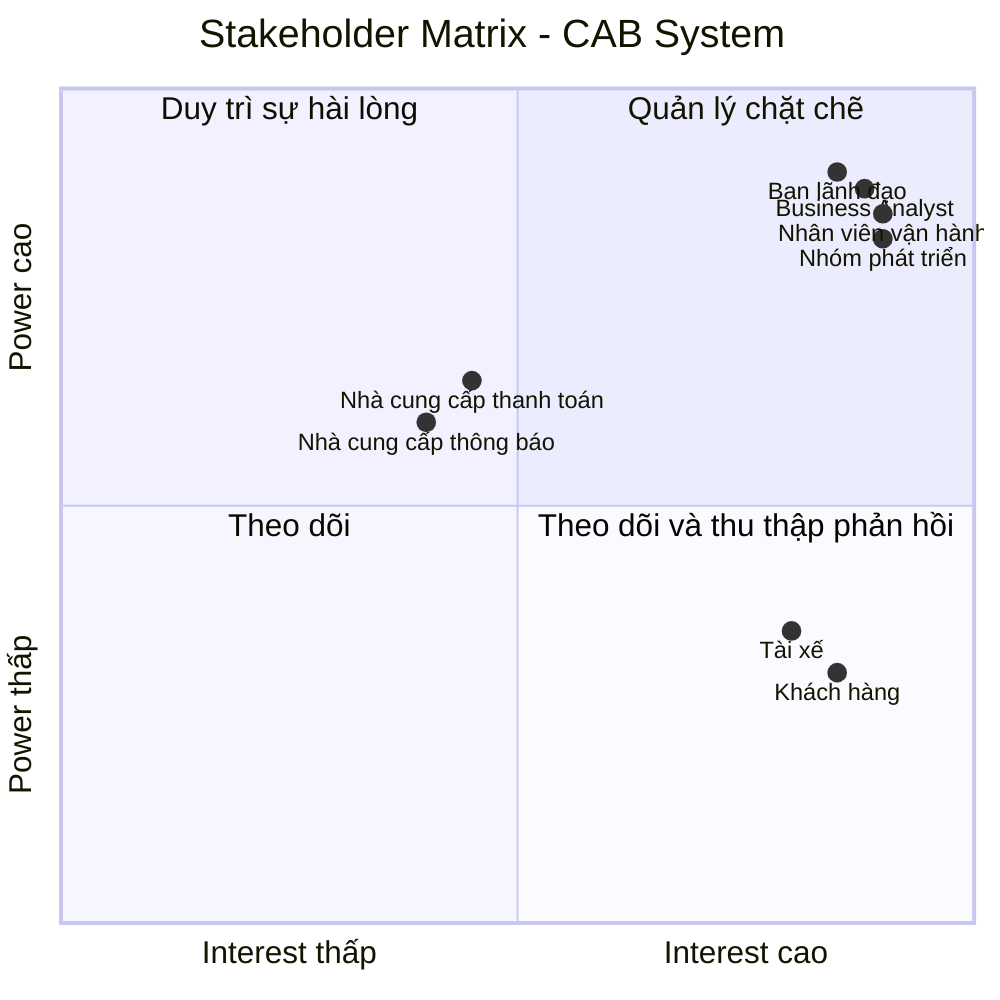
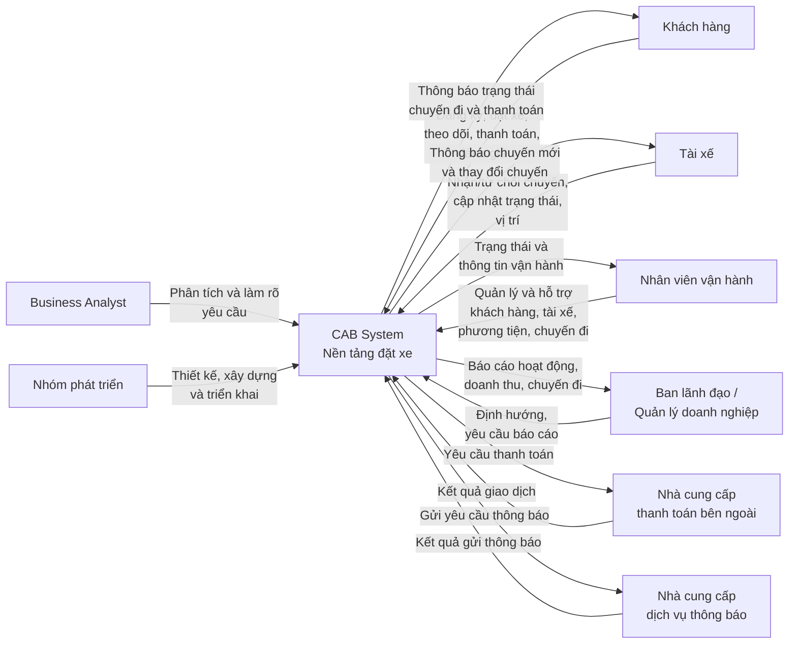

## 3. Stakeholder Identification

### 3.1. Danh sách Stakeholder

| STT | Stakeholder                         | Vai trò                                                                                                                                                                  |
| --- | ----------------------------------- | ------------------------------------------------------------------------------------------------------------------------------------------------------------------------ |
| 1   | Khách hàng                          | Người sử dụng hệ thống để đăng ký, đặt xe, theo dõi chuyến đi, thanh toán, xem lịch sử và đánh giá tài xế.                                                               |
| 2   | Tài xế                              | Người nhận và thực hiện chuyến xe; cập nhật trạng thái chuyến đi, thông tin phương tiện và trạng thái hoạt động.                                                         |
| 3   | Nhân viên vận hành                  | Quản lý khách hàng, tài xế, phương tiện và chuyến đi; theo dõi chuyến đang diễn ra và hỗ trợ xử lý các trường hợp phát sinh.                                             |
| 4   | Ban lãnh đạo / Quản lý doanh nghiệp | Định hướng hoạt động của hệ thống, theo dõi báo cáo về số lượng chuyến, doanh thu, tỷ lệ hoàn thành, tỷ lệ hủy và hiệu quả tài xế.                                       |
| 5   | Nhà cung cấp thanh toán bên ngoài   | Cung cấp dịch vụ xử lý thanh toán điện tử cho hệ thống CAB.                                                                                                              |
| 6   | Nhà cung cấp dịch vụ thông báo      | Cung cấp các kênh gửi thông báo cho khách hàng và tài xế; có thể được mở rộng hoặc thay thế trong tương lai.                                                             |
| 7   | Business Analyst (BA)               | Làm rõ các yêu cầu chưa được chốt với các bên liên quan và xác định phạm vi, tác nhân, quy trình nghiệp vụ, yêu cầu chức năng, phi chức năng và các trường hợp ngoại lệ. |
| 8   | Nhóm phát triển hệ thống            | Phân tích, thiết kế, xây dựng và triển khai nền tảng CAB dựa trên các yêu cầu đã được xác định.                                                                          |

### 3.2. Vai trò và mức độ quan tâm của Stakeholder

| Stakeholder                         | Quyền lực (Power) | Mức độ quan tâm (Interest) | Mức độ ưu tiên | Chiến lược quản lý                                                   |
| ----------------------------------- | ----------------- | -------------------------- | -------------- | -------------------------------------------------------------------- |
| Ban lãnh đạo / Quản lý doanh nghiệp | Cao               | Cao                        | Rất cao        | Quản lý chặt chẽ, thường xuyên cập nhật và lấy ý kiến                |
| Nhân viên vận hành                  | Cao               | Cao                        | Rất cao        | Tham gia thường xuyên, lấy phản hồi trong quá trình phân tích        |
| Khách hàng                          | Thấp              | Cao                        | Cao            | Theo dõi nhu cầu và đảm bảo hệ thống đáp ứng trải nghiệm sử dụng     |
| Tài xế                              | Thấp              | Cao                        | Cao            | Thường xuyên thu thập phản hồi về quy trình nhận và thực hiện chuyến |
| Nhà cung cấp thanh toán bên ngoài   | Trung bình        | Trung bình                 | Trung bình     | Phối hợp và theo dõi việc tích hợp                                   |
| Nhà cung cấp dịch vụ thông báo      | Trung bình        | Trung bình                 | Trung bình     | Phối hợp về giao tiếp và khả năng mở rộng kênh thông báo             |
| Business Analyst (BA)               | Cao               | Cao                        | Rất cao        | Phối hợp chặt chẽ với các stakeholder để làm rõ yêu cầu              |
| Nhóm phát triển hệ thống            | Cao               | Cao                        | Rất cao        | Phối hợp chặt chẽ trong quá trình thiết kế và triển khai             |

---

## 3.3. Stakeholder Matrix

Stakeholder Matrix được phân loại dựa trên hai tiêu chí: **Power (Quyền lực)** và **Interest (Mức độ quan tâm)**.

|                | **Interest thấp**                                                 | **Interest cao**                                                                                    |
| -------------- | ----------------------------------------------------------------- | --------------------------------------------------------------------------------------------------- |
| **Power cao**  | Nhà cung cấp thanh toán bên ngoài, Nhà cung cấp dịch vụ thông báo | Ban lãnh đạo / Quản lý doanh nghiệp, Nhân viên vận hành, Business Analyst, Nhóm phát triển hệ thống |
| **Power thấp** | —                                                                 | Khách hàng, Tài xế                                                                                  |

### Chiến lược theo Stakeholder Matrix

* **Power cao – Interest cao:** Quản lý chặt chẽ. Đây là nhóm cần được tham gia thường xuyên vì có khả năng quyết định hoặc ảnh hưởng lớn đến hệ thống.
* **Power cao – Interest thấp:** Duy trì sự hài lòng và phối hợp khi cần thiết, đặc biệt đối với các bên cung cấp dịch vụ bên ngoài.
* **Power thấp – Interest cao:** Theo dõi và thu thập phản hồi thường xuyên vì đây là những người trực tiếp sử dụng hoặc chịu ảnh hưởng bởi hệ thống.
* **Power thấp – Interest thấp:** Không có stakeholder chính thuộc nhóm này trong phạm vi yêu cầu hiện tại.

---

## 3.4. Mermaid – Stakeholder Matrix

## 3.5. Mermaid – Sơ đồ Stakeholder và CAB System

