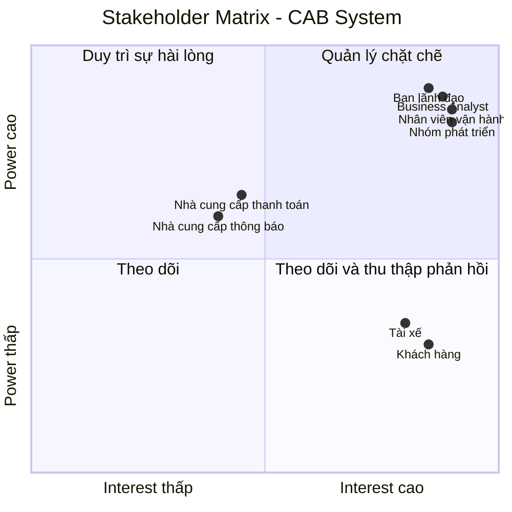
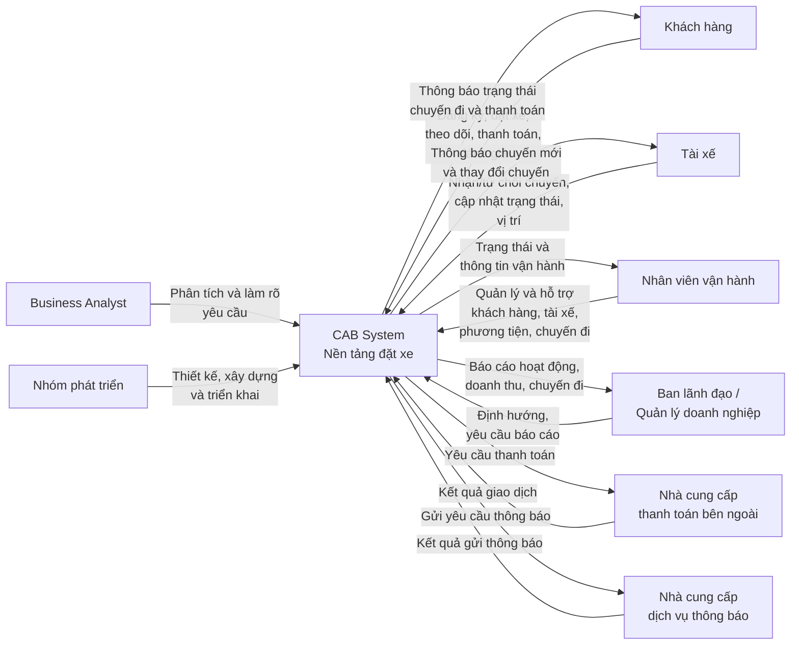
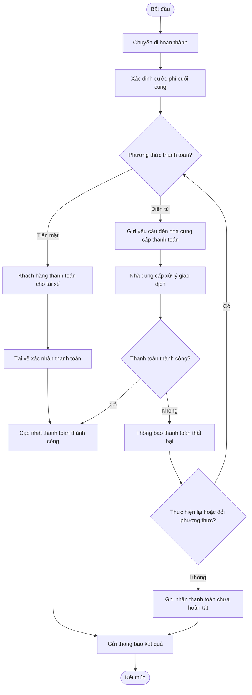
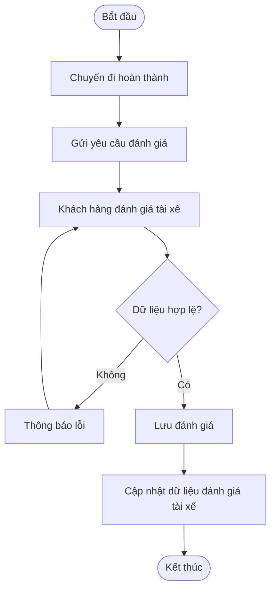

## 3. Stakeholder Identification

### 3.1. Danh sách Stakeholder

| STT | Stakeholder                         | Vai trò                                                                                                                                                                  |
| --- | ----------------------------------- | ------------------------------------------------------------------------------------------------------------------------------------------------------------------------ |
| 1   | Khách hàng                          | Người sử dụng hệ thống để đăng ký, đặt xe, theo dõi chuyến đi, thanh toán, xem lịch sử và đánh giá tài xế.                                                               |
| 2   | Tài xế                              | Người nhận và thực hiện chuyến xe; cập nhật trạng thái chuyến đi, thông tin phương tiện và trạng thái hoạt động.                                                         |
| 3   | Nhân viên vận hành                  | Quản lý khách hàng, tài xế, phương tiện và chuyến đi; theo dõi chuyến đang diễn ra và hỗ trợ xử lý các trường hợp phát sinh.                                             |
| 4   | Ban lãnh đạo / Quản lý doanh nghiệp | Định hướng hoạt động của hệ thống, theo dõi báo cáo về số lượng chuyến, doanh thu, tỷ lệ hoàn thành, tỷ lệ hủy và hiệu quả tài xế.                                       |
| 5   | Nhà cung cấp thanh toán bên ngoài   | Cung cấp dịch vụ xử lý thanh toán điện tử cho hệ thống CAB.                                                                                                              |
| 6   | Nhà cung cấp dịch vụ thông báo      | Cung cấp các kênh gửi thông báo cho khách hàng và tài xế; có thể được mở rộng hoặc thay thế trong tương lai.                                                             |
| 7   | Business Analyst (BA)               | Làm rõ các yêu cầu chưa được chốt với các bên liên quan và xác định phạm vi, tác nhân, quy trình nghiệp vụ, yêu cầu chức năng, phi chức năng và các trường hợp ngoại lệ. |
| 8   | Nhóm phát triển hệ thống            | Phân tích, thiết kế, xây dựng và triển khai nền tảng CAB dựa trên các yêu cầu đã được xác định.                                                                          |

### 3.2. Vai trò và mức độ quan tâm của Stakeholder

| Stakeholder                         | Quyền lực (Power) | Mức độ quan tâm (Interest) | Mức độ ưu tiên | Chiến lược quản lý                                                   |
| ----------------------------------- | ----------------- | -------------------------- | -------------- | -------------------------------------------------------------------- |
| Ban lãnh đạo / Quản lý doanh nghiệp | Cao               | Cao                        | Rất cao        | Quản lý chặt chẽ, thường xuyên cập nhật và lấy ý kiến                |
| Nhân viên vận hành                  | Cao               | Cao                        | Rất cao        | Tham gia thường xuyên, lấy phản hồi trong quá trình phân tích        |
| Khách hàng                          | Thấp              | Cao                        | Cao            | Theo dõi nhu cầu và đảm bảo hệ thống đáp ứng trải nghiệm sử dụng     |
| Tài xế                              | Thấp              | Cao                        | Cao            | Thường xuyên thu thập phản hồi về quy trình nhận và thực hiện chuyến |
| Nhà cung cấp thanh toán bên ngoài   | Trung bình        | Trung bình                 | Trung bình     | Phối hợp và theo dõi việc tích hợp                                   |
| Nhà cung cấp dịch vụ thông báo      | Trung bình        | Trung bình                 | Trung bình     | Phối hợp về giao tiếp và khả năng mở rộng kênh thông báo             |
| Business Analyst (BA)               | Cao               | Cao                        | Rất cao        | Phối hợp chặt chẽ với các stakeholder để làm rõ yêu cầu              |
| Nhóm phát triển hệ thống            | Cao               | Cao                        | Rất cao        | Phối hợp chặt chẽ trong quá trình thiết kế và triển khai             |

---

## 3.3. Stakeholder Matrix

Stakeholder Matrix được phân loại dựa trên hai tiêu chí: **Power (Quyền lực)** và **Interest (Mức độ quan tâm)**.

|                | **Interest thấp**                                                 | **Interest cao**                                                                                    |
| -------------- | ----------------------------------------------------------------- | --------------------------------------------------------------------------------------------------- |
| **Power cao**  | Nhà cung cấp thanh toán bên ngoài, Nhà cung cấp dịch vụ thông báo | Ban lãnh đạo / Quản lý doanh nghiệp, Nhân viên vận hành, Business Analyst, Nhóm phát triển hệ thống |
| **Power thấp** | —                                                                 | Khách hàng, Tài xế                                                                                  |

### Chiến lược theo Stakeholder Matrix

* **Power cao – Interest cao:** Quản lý chặt chẽ. Đây là nhóm cần được tham gia thường xuyên vì có khả năng quyết định hoặc ảnh hưởng lớn đến hệ thống.
* **Power cao – Interest thấp:** Duy trì sự hài lòng và phối hợp khi cần thiết, đặc biệt đối với các bên cung cấp dịch vụ bên ngoài.
* **Power thấp – Interest cao:** Theo dõi và thu thập phản hồi thường xuyên vì đây là những người trực tiếp sử dụng hoặc chịu ảnh hưởng bởi hệ thống.
* **Power thấp – Interest thấp:** Không có stakeholder chính thuộc nhóm này trong phạm vi yêu cầu hiện tại.

---

## 3.4. Mermaid – Stakeholder Matrix

## 3.5. Mermaid – Sơ đồ Stakeholder và CAB System

## 4. Business Goals

### BG-01 – Nâng cao chất lượng dịch vụ đặt xe

**Business Goal:**
Xây dựng một nền tảng CAB giúp khách hàng thực hiện toàn bộ quy trình đặt xe thuận tiện, từ tạo yêu cầu, tìm tài xế, theo dõi chuyến đi, thanh toán đến đánh giá sau chuyến.

**Mục tiêu:**

* Giảm những hạn chế của hệ thống đặt xe hiện tại.
* Cải thiện trải nghiệm của khách hàng trong quá trình đặt và sử dụng dịch vụ.
* Cung cấp thông tin rõ ràng về trạng thái chuyến đi cho khách hàng.

---

### BG-02 – Nâng cao hiệu quả phân công tài xế

**Business Goal:**
Tự động hóa và cải thiện quá trình tìm kiếm, lựa chọn và phân công tài xế phù hợp cho mỗi yêu cầu đặt xe.

**Mục tiêu:**

* Ưu tiên tài xế phù hợp và ở gần khách hàng.
* Giảm sự phụ thuộc vào việc phân công thủ công.
* Có khả năng tiếp tục tìm tài xế khác khi tài xế được đề xuất không phản hồi hoặc từ chối chuyến.
* Hạn chế trường hợp khách hàng phải tạo lại yêu cầu khi việc phân công tài xế thất bại.

### BG-03 – Nâng cao hiệu quả quản lý và vận hành

**Business Goal:**
Tập trung hóa hoạt động quản lý khách hàng, tài xế, phương tiện và chuyến đi nhằm giúp bộ phận vận hành theo dõi và xử lý hoạt động kinh doanh hiệu quả hơn.

**Mục tiêu:**

* Hỗ trợ nhân viên vận hành theo dõi các chuyến đang diễn ra.
* Kiểm tra trạng thái hoạt động của tài xế.
* Hỗ trợ xử lý các trường hợp chuyến đi bị lỗi.
* Tra cứu lịch sử giao dịch.
* Phân quyền các thao tác quản trị theo vai trò.

---

### BG-04 – Quản lý doanh thu và thanh toán hiệu quả

**Business Goal:**
Xây dựng quy trình tính cước và thanh toán tập trung, chính xác và có khả năng tích hợp với các dịch vụ thanh toán điện tử bên ngoài.

**Mục tiêu:**

* Xác định chính xác số tiền khách hàng cần thanh toán sau chuyến đi.
* Hỗ trợ cả thanh toán tiền mặt và thanh toán điện tử.
* Giảm rủi ro khi quản lý thông tin thanh toán nhạy cảm.
* Có khả năng xử lý lại giao dịch khi thanh toán điện tử thất bại.
* Cung cấp dữ liệu phục vụ theo dõi doanh thu.

Tài liệu yêu cầu doanh nghiệp tích hợp nhà cung cấp thanh toán bên ngoài nhưng không lưu trực tiếp thông tin nhạy cảm của thẻ hoặc tài khoản thanh toán trong hệ thống CAB.

---

### BG-05 – Cải thiện khả năng theo dõi và giao tiếp với khách hàng, tài xế

**Business Goal:**
Cung cấp thông tin kịp thời cho khách hàng và tài xế trong suốt quá trình sử dụng dịch vụ.

**Mục tiêu:**

* Thông báo cho khách hàng về trạng thái yêu cầu và chuyến đi.
* Thông báo khi tài xế nhận chuyến và khi tài xế đến điểm đón.
* Thông báo kết quả thanh toán.
* Thông báo cho tài xế về chuyến mới và các thay đổi liên quan đến chuyến đang thực hiện.
* Cho phép mở rộng thêm các kênh thông báo trong tương lai.

---

### BG-06 – Đảm bảo hệ thống hoạt động ổn định và có khả năng mở rộng

**Business Goal:**
Xây dựng nền tảng CAB có khả năng đáp ứng nhu cầu tăng cao và phát triển lâu dài mà không ảnh hưởng lớn đến các chức năng đang hoạt động.

**Mục tiêu:**

* Duy trì hoạt động ổn định khi nhu cầu sử dụng tăng cao.
* Cho phép các thành phần của hệ thống mở rộng độc lập khi tải tăng.
* Cho phép triển khai từng phần các chức năng mới.
* Hạn chế ảnh hưởng của lỗi ở một thành phần đến toàn bộ hệ thống.
* Tạo nền tảng có thể phục vụ số lượng lớn khách hàng và tài xế.

Đây là một trong những kỳ vọng quan trọng của doanh nghiệp đối với nền tảng CAB mới.

---

### BG-07 – Đảm bảo an toàn và bảo mật dữ liệu

**Business Goal:**
Bảo vệ thông tin người dùng, dữ liệu vận hành và dữ liệu giao dịch trong quá trình hệ thống hoạt động.

**Mục tiêu:**

* Đảm bảo khách hàng và tài xế được xác thực trước khi sử dụng các chức năng yêu cầu tài khoản.
* Kiểm soát quyền truy cập đối với các thao tác quản trị.
* Bảo vệ thông tin cá nhân, thông tin phương tiện, dữ liệu vị trí và dữ liệu giao dịch.
* Lưu vết các thao tác quan trọng để hỗ trợ kiểm tra và xử lý sự cố.

Các mục tiêu này được xác định trực tiếp từ yêu cầu bảo mật của doanh nghiệp.

---

### BG-08 – Hỗ trợ ra quyết định và đánh giá hiệu quả kinh doanh

**Business Goal:**
Cung cấp dữ liệu và báo cáo cần thiết để ban lãnh đạo theo dõi tình hình hoạt động và đánh giá hiệu quả kinh doanh của dịch vụ đặt xe.

**Mục tiêu:**

* Theo dõi số lượng chuyến.
* Theo dõi doanh thu.
* Theo dõi tỷ lệ chuyến hoàn thành.
* Theo dõi tỷ lệ hủy chuyến.
* Đánh giá hiệu quả hoạt động của tài xế.

Ban lãnh đạo được kỳ vọng có báo cáo về các chỉ số hoạt động này.

---

### BG-09 – Tạo nền tảng linh hoạt cho phát triển trong tương lai

**Business Goal:**
Xây dựng nền tảng CAB có khả năng thích ứng với các nhu cầu kinh doanh mới mà không phải xây dựng lại toàn bộ hệ thống.

**Mục tiêu:**

* Có thể bổ sung các loại dịch vụ mới.
* Có thể thêm các phương thức thanh toán mới.
* Có thể tích hợp thêm các nhà cung cấp dịch vụ thông báo.
* Có thể thay đổi một số thành phần kỹ thuật khi cần.
* Hỗ trợ doanh nghiệp phát triển hệ thống trong dài hạn.

Mục tiêu này phù hợp với kỳ vọng của doanh nghiệp về một nền tảng CAB có thể phát triển lâu dài và linh hoạt mở rộng.

---

## 4.1. Business Goals Summary

| ID    | Business Goal                             | Mục đích chính                           |
| ----- | ----------------------------------------- | ---------------------------------------- |
| BG-01 | Nâng cao chất lượng dịch vụ đặt xe        | Cải thiện trải nghiệm khách hàng         |
| BG-02 | Nâng cao hiệu quả phân công tài xế        | Tìm và phân công tài xế phù hợp          |
| BG-03 | Nâng cao hiệu quả quản lý và vận hành     | Hỗ trợ bộ phận vận hành quản lý hệ thống |
| BG-04 | Quản lý doanh thu và thanh toán hiệu quả  | Quản lý cước và thanh toán               |
| BG-05 | Cải thiện khả năng theo dõi và giao tiếp  | Cung cấp thông tin kịp thời              |
| BG-06 | Đảm bảo ổn định và khả năng mở rộng       | Đáp ứng nhu cầu tăng trưởng              |
| BG-07 | Đảm bảo an toàn và bảo mật dữ liệu        | Bảo vệ dữ liệu và kiểm soát truy cập     |
| BG-08 | Hỗ trợ ra quyết định và đánh giá hiệu quả | Cung cấp báo cáo cho quản lý             |
| BG-09 | Tạo nền tảng linh hoạt cho tương lai      | Hỗ trợ mở rộng dịch vụ và công nghệ      |

## 5. Project Scope – Xác định phạm vi phát triển

Dựa trên các Business Goals đã xác định, sẽ giới hạn phạm vi phát triển trong giai đoạn đầu để phù hợp với thời gian xây dựng và triển khai sản phẩm là **7 tuần**.

Các chức năng được ưu tiên là những chức năng **cốt lõi để hệ thống CAB có thể thực hiện được quy trình đặt xe hoàn chỉnh**: khách hàng tạo yêu cầu → tìm tài xế → thực hiện chuyến → tính cước → thanh toán → thông báo → đánh giá.

### Các module nằm trong phạm vi phát triển

| STT | Module                                | Business Goal liên quan | Phạm vi chính                                                                                               | Mức độ          |
| --- | ------------------------------------- | ----------------------- | ----------------------------------------------------------------------------------------------------------- | --------------- |
| 1   | **User & Account Management**         | BG-01, BG-07            | Đăng ký, đăng nhập, cập nhật thông tin khách hàng và tài xế; xác thực người dùng                            | **Must Have**   |
| 2   | **Driver Management**                 | BG-02, BG-03            | Quản lý hồ sơ tài xế, phương tiện và trạng thái sẵn sàng nhận chuyến                                        | **Must Have**   |
| 3   | **Booking Management**                | BG-01, BG-02            | Nhập điểm đón/điểm đến, lựa chọn loại xe, tạo và quản lý yêu cầu đặt xe                                     | **Must Have**   |
| 4   | **Driver Matching & Trip Management** | BG-02, BG-03            | Tìm tài xế phù hợp, gửi yêu cầu nhận chuyến, xử lý từ chối/không phản hồi, cập nhật trạng thái chuyến       | **Must Have**   |
| 5   | **Fare & Payment Management**         | BG-04                   | Tính cước, hỗ trợ tiền mặt và thanh toán điện tử thông qua nhà cung cấp bên ngoài, xử lý kết quả thanh toán | **Must Have**   |
| 6   | **Notification Management**           | BG-05                   | Gửi thông báo về đặt xe, tài xế nhận chuyến, tài xế đến, hoàn thành chuyến và thanh toán                    | **Must Have**   |
| 7   | **Rating & Trip History**             | BG-01                   | Xem lịch sử chuyến đi, số tiền phải trả và đánh giá tài xế sau chuyến                                       | **Should Have** |
| 8   | **Operation Management**              | BG-03                   | Quản lý khách hàng, tài xế, phương tiện, chuyến đi; theo dõi chuyến đang diễn ra và xử lý trường hợp lỗi    | **Must Have**   |
| 9   | **Report & Dashboard**                | BG-08                   | Báo cáo số lượng chuyến, doanh thu, tỷ lệ hoàn thành, tỷ lệ hủy và hiệu quả tài xế                          | **Should Have** |
| 10  | **Security & Access Control**         | BG-07                   | Phân quyền quản trị, kiểm soát truy cập và lưu vết các thao tác quan trọng                                  | **Must Have**   |

# 6. Business Requirements

### BG01 – Quản lý và đặt xe

Hệ thống phải hỗ trợ khách hàng quản lý tài khoản, tạo yêu cầu đặt xe, theo dõi chuyến đi, xem lịch sử chuyến đi và đánh giá tài xế.

### BG02 – Quản lý và phân công tài xế

Hệ thống phải hỗ trợ quản lý thông tin, trạng thái hoạt động của tài xế và tự động tìm kiếm, phân công tài xế phù hợp cho từng yêu cầu đặt xe.

### BG03 – Quản lý chuyến đi và vận hành

Hệ thống phải hỗ trợ nhân viên vận hành quản lý khách hàng, tài xế, phương tiện và chuyến đi; đồng thời theo dõi các chuyến đang diễn ra và xử lý các trường hợp phát sinh.

### BG04 – Quản lý cước phí và thanh toán

Hệ thống phải hỗ trợ tính cước chuyến đi, thanh toán bằng tiền mặt hoặc phương thức điện tử, tích hợp với nhà cung cấp thanh toán bên ngoài và xử lý trường hợp thanh toán thất bại.

### BG05 – Quản lý thông báo

Hệ thống phải cung cấp thông báo cho khách hàng và tài xế về các sự kiện liên quan đến quá trình đặt xe, phân công tài xế, chuyến đi và thanh toán.

### BG06 – Đảm bảo tính ổn định và khả năng mở rộng

Hệ thống phải hoạt động ổn định trong thời gian cao điểm, hạn chế ảnh hưởng khi một thành phần gặp lỗi và cho phép các thành phần được mở rộng hoặc triển khai độc lập.

### BG07 – Đảm bảo an toàn và bảo mật

Hệ thống phải xác thực người dùng, kiểm soát quyền truy cập quản trị, bảo vệ dữ liệu cá nhân, thông tin phương tiện, vị trí và giao dịch, đồng thời lưu vết các thao tác quan trọng.

### BG08 – Báo cáo và đánh giá hiệu quả kinh doanh

Hệ thống phải cung cấp các báo cáo phục vụ quản lý và ra quyết định, bao gồm số lượng chuyến, doanh thu, tỷ lệ hoàn thành, tỷ lệ hủy và hiệu quả hoạt động của tài xế.

### BG09 – Hỗ trợ mở rộng trong tương lai

Hệ thống phải có kiến trúc linh hoạt để có thể bổ sung loại hình dịch vụ, phương thức thanh toán, nhà cung cấp thông báo và các thành phần kỹ thuật mới mà không cần xây dựng lại toàn bộ hệ thống.

# 7. Business Process Modeling

## 7.1. Tổng quan quy trình nghiệp vụ

Hệ thống quản lý và đặt xe bao gồm các quy trình nghiệp vụ chính từ khi khách hàng tạo yêu cầu đặt xe, hệ thống tìm kiếm và phân công tài xế, thực hiện chuyến đi, thanh toán cho đến khi hoàn tất chuyến và đánh giá tài xế.

Các quy trình chính gồm:

1. Đặt xe và phân công tài xế.
2. Thực hiện và theo dõi chuyến đi.
3. Thanh toán và xử lý thanh toán thất bại.
4. Đánh giá chuyến đi và tài xế.
5. Quản lý và vận hành tài xế, phương tiện và chuyến đi.
6. Quản lý thông báo.
7. Báo cáo và đánh giá hiệu quả kinh doanh.

---

## 7.2. Quy trình đặt xe và phân công tài xế

### 7.2.1. Mục tiêu

Quy trình cho phép khách hàng tạo yêu cầu đặt xe và hệ thống tự động tìm kiếm, phân công tài xế phù hợp.

### 7.2.2. Tác nhân tham gia

* **Khách hàng**
* **Hệ thống**
* **Tài xế**
* **Nhân viên vận hành**

### 7.2.3. Quy trình

1. Khách hàng đăng nhập vào hệ thống.
2. Khách hàng nhập thông tin chuyến đi gồm điểm đón, điểm đến và các thông tin cần thiết.
3. Hệ thống kiểm tra tính hợp lệ của yêu cầu.
4. Nếu thông tin không hợp lệ, hệ thống yêu cầu khách hàng điều chỉnh.
5. Nếu thông tin hợp lệ, hệ thống tạo yêu cầu đặt xe.
6. Hệ thống tính cước dự kiến cho chuyến đi.
7. Hệ thống tìm kiếm các tài xế phù hợp dựa trên trạng thái hoạt động, vị trí và khả năng đáp ứng.
8. Hệ thống gửi yêu cầu nhận chuyến đến tài xế phù hợp.
9. Tài xế chấp nhận hoặc từ chối yêu cầu.
10. Nếu tài xế từ chối hoặc không phản hồi, hệ thống tiếp tục tìm kiếm tài xế khác.
11. Nếu có tài xế nhận chuyến, hệ thống xác nhận chuyến đi.
12. Hệ thống gửi thông báo cho khách hàng và tài xế.
13. Quy trình kết thúc.

### 7.2.4. Sơ đồ quy trình

---

## 7.3. Quy trình thực hiện và theo dõi chuyến đi

### 7.3.1. Mục tiêu

Quy trình quản lý chuyến đi từ khi tài xế được phân công đến khi chuyến đi hoàn tất hoặc phát sinh vấn đề cần xử lý.

### 7.3.2. Tác nhân tham gia

* **Khách hàng**
* **Tài xế**
* **Hệ thống**
* **Nhân viên vận hành**

### 7.3.3. Quy trình

1. Sau khi chuyến đi được xác nhận, tài xế nhận thông tin chuyến.
2. Tài xế di chuyển đến điểm đón.
3. Hệ thống cập nhật trạng thái chuyến đi.
4. Khách hàng theo dõi trạng thái và thông tin chuyến đi.
5. Tài xế đón khách.
6. Tài xế bắt đầu chuyến đi.
7. Hệ thống cập nhật và lưu thông tin chuyến đi trong quá trình di chuyển.
8. Nếu phát sinh sự cố, tài xế hoặc khách hàng gửi thông tin đến hệ thống.
9. Nhân viên vận hành tiếp nhận và xử lý trường hợp phát sinh.
10. Tài xế đưa khách đến điểm đến.
11. Tài xế kết thúc chuyến đi.
12. Hệ thống cập nhật trạng thái chuyến thành hoàn thành.
13. Hệ thống chuyển sang quy trình thanh toán.
14. Quy trình kết thúc.

### 7.3.4. Sơ đồ quy trình

---

## 7.4. Quy trình thanh toán

### 7.4.1. Mục tiêu

Quy trình thực hiện thanh toán cước chuyến đi bằng tiền mặt hoặc phương thức thanh toán điện tử.

### 7.4.2. Tác nhân tham gia

* **Khách hàng**
* **Hệ thống**
* **Nhà cung cấp dịch vụ thanh toán**
* **Tài xế**

### 7.4.3. Quy trình

1. Chuyến đi được hoàn thành.
2. Hệ thống xác định cước phí cuối cùng.
3. Hệ thống xác định phương thức thanh toán của khách hàng.
4. Nếu khách hàng thanh toán bằng tiền mặt, khách hàng thanh toán trực tiếp cho tài xế.
5. Tài xế xác nhận đã nhận tiền.
6. Hệ thống cập nhật trạng thái thanh toán thành công.
7. Nếu khách hàng thanh toán điện tử, hệ thống gửi yêu cầu thanh toán đến nhà cung cấp dịch vụ thanh toán.
8. Nhà cung cấp thanh toán xử lý giao dịch.
9. Hệ thống nhận kết quả giao dịch.
10. Nếu giao dịch thành công, hệ thống cập nhật trạng thái thanh toán.
11. Nếu giao dịch thất bại, hệ thống thông báo cho khách hàng và cho phép thực hiện lại hoặc lựa chọn phương thức thanh toán khác.
12. Hệ thống gửi thông báo kết quả thanh toán.
13. Quy trình kết thúc.

### 7.4.4. Sơ đồ quy trình

---

## 7.5. Quy trình đánh giá chuyến đi và tài xế

### 7.5.1. Mục tiêu

Cho phép khách hàng đánh giá chất lượng chuyến đi và tài xế sau khi chuyến đi hoàn tất.

### 7.5.2. Quy trình

1. Chuyến đi được hoàn thành.
2. Hệ thống gửi yêu cầu đánh giá đến khách hàng.
3. Khách hàng lựa chọn mức đánh giá và nhập nhận xét nếu cần.
4. Hệ thống kiểm tra dữ liệu đánh giá.
5. Hệ thống lưu đánh giá.
6. Hệ thống cập nhật dữ liệu đánh giá của tài xế.
7. Dữ liệu đánh giá được sử dụng cho việc theo dõi và đánh giá hiệu quả tài xế.
8. Quy trình kết thúc.

### 7.5.3. Sơ đồ quy trình

---

## 7.6. Quy trình quản lý và vận hành

### 7.6.1. Mục tiêu

Hỗ trợ nhân viên vận hành quản lý khách hàng, tài xế, phương tiện và các chuyến đi đang diễn ra.

### 7.6.2. Tác nhân tham gia

* **Nhân viên vận hành**
* **Hệ thống**
* **Khách hàng**
* **Tài xế**

### 7.6.3. Quy trình

1. Nhân viên vận hành đăng nhập hệ thống.
2. Hệ thống xác thực tài khoản và quyền truy cập.
3. Nhân viên lựa chọn chức năng cần quản lý.
4. Hệ thống cung cấp thông tin tương ứng về khách hàng, tài xế, phương tiện hoặc chuyến đi.
5. Nhân viên theo dõi trạng thái hoạt động của tài xế và chuyến đi.
6. Khi phát hiện vấn đề, nhân viên tiếp nhận và xử lý.
7. Hệ thống cập nhật kết quả xử lý.
8. Hệ thống lưu vết các thao tác quản trị quan trọng.
9. Quy trình kết thúc.

### 7.6.4. Sơ đồ quy trình

---

## 7.7. Quy trình quản lý thông báo

### 7.7.1. Mục tiêu

Đảm bảo khách hàng và tài xế nhận được thông tin kịp thời về các sự kiện liên quan đến đặt xe, phân công tài xế, chuyến đi và thanh toán.

### 7.7.2. Quy trình

1. Hệ thống phát sinh một sự kiện nghiệp vụ.
2. Hệ thống xác định đối tượng cần nhận thông báo.
3. Hệ thống xác định loại thông báo và kênh gửi.
4. Hệ thống gửi thông báo.
5. Hệ thống kiểm tra kết quả gửi.
6. Nếu gửi thành công, hệ thống ghi nhận trạng thái thông báo.
7. Nếu gửi thất bại, hệ thống ghi nhận lỗi và thực hiện cơ chế gửi lại theo cấu hình.
8. Quy trình kết thúc.

### 7.7.3. Sơ đồ quy trình

---

## 7.8. Quy trình báo cáo và đánh giá hiệu quả kinh doanh

### 7.8.1. Mục tiêu

Cung cấp thông tin phục vụ quản lý, theo dõi hoạt động kinh doanh và đánh giá hiệu quả vận hành.

### 7.8.2. Quy trình

1. Nhân viên quản lý truy cập chức năng báo cáo.
2. Nhân viên lựa chọn loại báo cáo và khoảng thời gian.
3. Hệ thống truy xuất dữ liệu liên quan.
4. Hệ thống tổng hợp và tính toán các chỉ số.
5. Hệ thống tạo báo cáo.
6. Nhân viên xem báo cáo.
7. Báo cáo có thể bao gồm:

   * Số lượng chuyến đi.
   * Doanh thu.
   * Tỷ lệ hoàn thành chuyến.
   * Tỷ lệ hủy chuyến.
   * Hiệu quả hoạt động của tài xế.
8. Nhân viên sử dụng báo cáo để theo dõi và ra quyết định.
9. Quy trình kết thúc.

### 7.8.3. Sơ đồ quy trình

---

## 7.9. Mối quan hệ giữa Business Requirements và Business Processes

| Business Requirement                                | Business Process liên quan                                                                          |
| --------------------------------------------------- | --------------------------------------------------------------------------------------------------- |
| **BG01 – Quản lý và đặt xe**                        | Quy trình đặt xe và phân công tài xế; Quy trình thực hiện và theo dõi chuyến đi; Quy trình đánh giá |
| **BG02 – Quản lý và phân công tài xế**              | Quy trình đặt xe và phân công tài xế; Quy trình quản lý và vận hành                                 |
| **BG03 – Quản lý chuyến đi và vận hành**            | Quy trình thực hiện và theo dõi chuyến đi; Quy trình quản lý và vận hành                            |
| **BG04 – Quản lý cước phí và thanh toán**           | Quy trình thanh toán                                                                                |
| **BG05 – Quản lý thông báo**                        | Quy trình quản lý thông báo                                                                         |
| **BG06 – Đảm bảo tính ổn định và khả năng mở rộng** | Áp dụng xuyên suốt các quy trình nghiệp vụ                                                          |
| **BG07 – Đảm bảo an toàn và bảo mật**               | Quy trình đăng nhập, xác thực, phân quyền và lưu vết trong các quy trình                            |
| **BG08 – Báo cáo và đánh giá hiệu quả kinh doanh**  | Quy trình báo cáo và đánh giá hiệu quả kinh doanh                                                   |
| **BG09 – Hỗ trợ mở rộng trong tương lai**           | Áp dụng xuyên suốt kiến trúc và các quy trình nghiệp vụ                                             |
