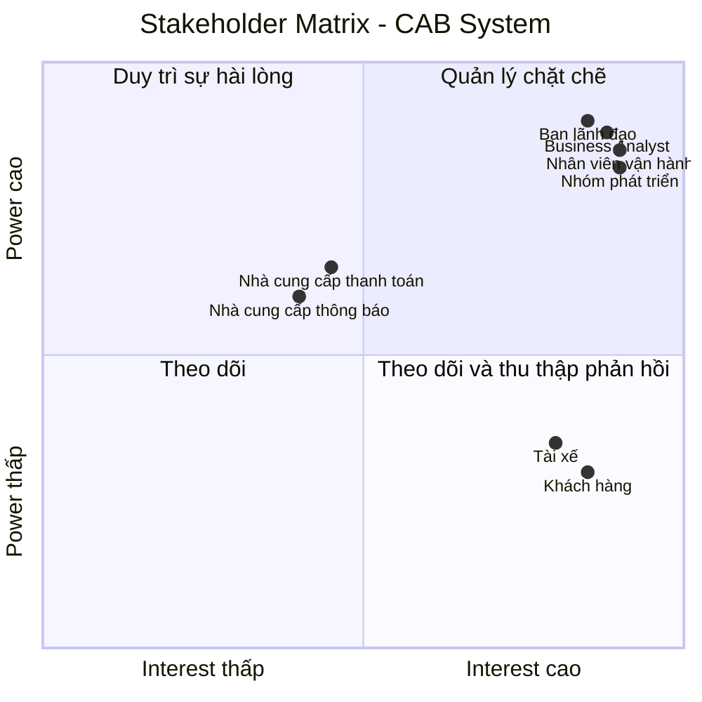
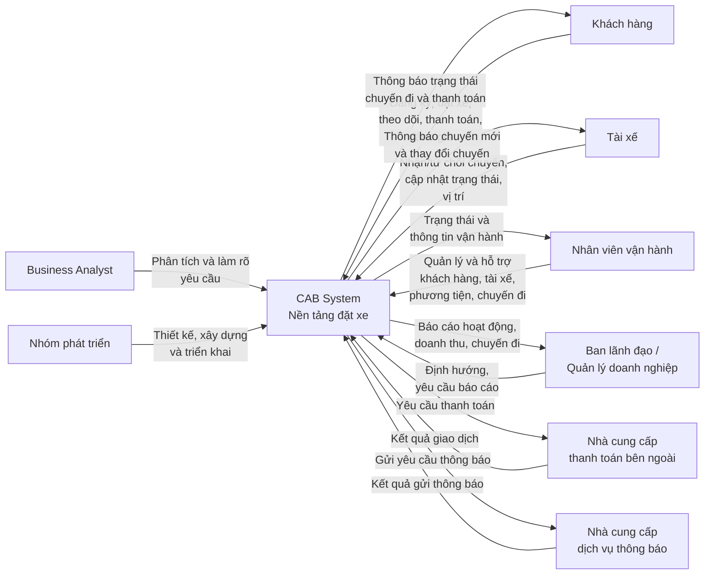
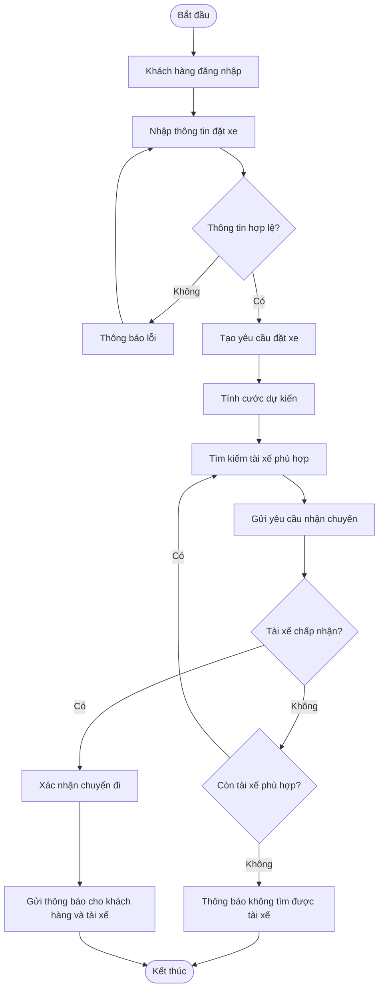
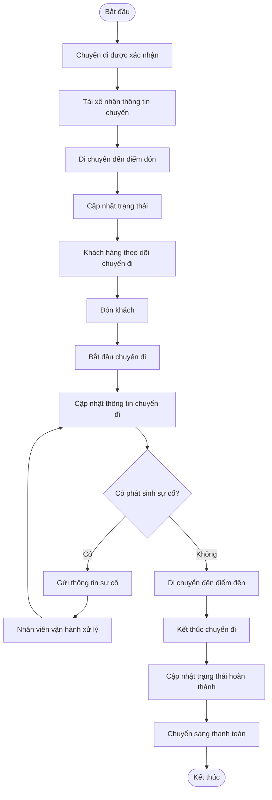
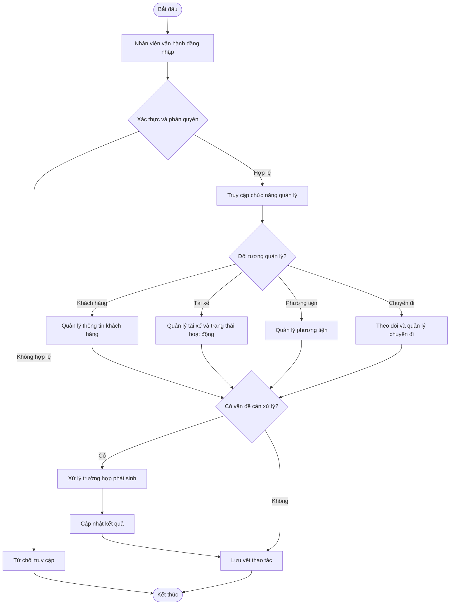
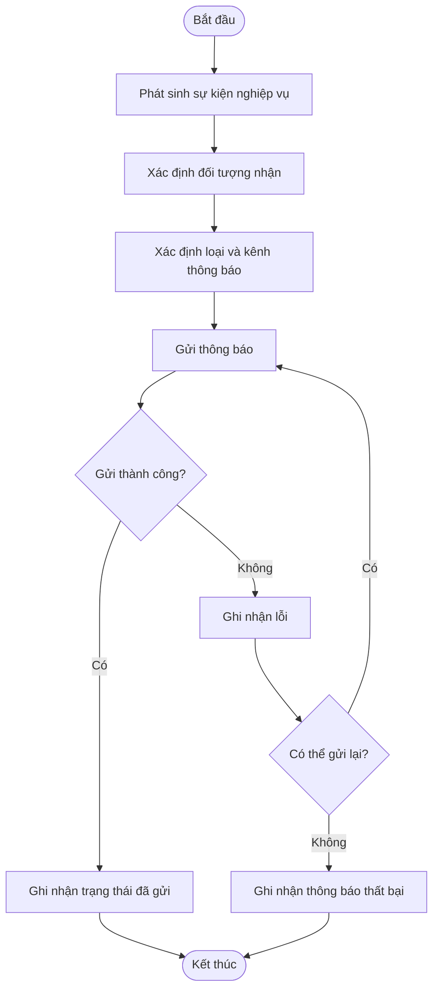
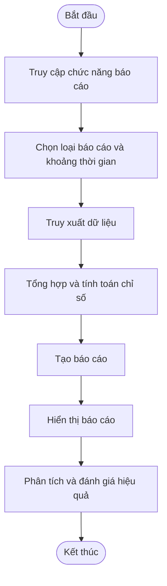
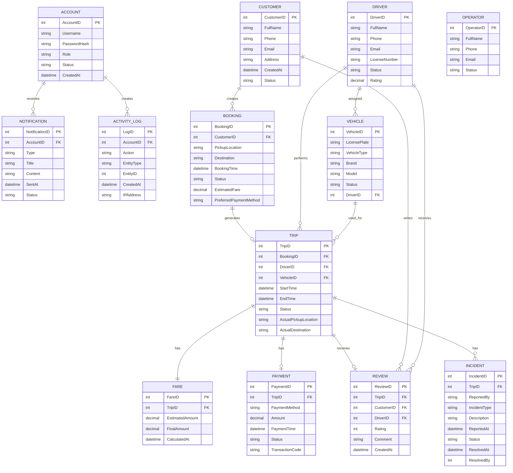
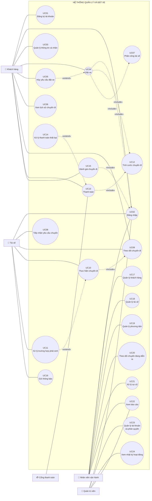

## 3. Stakeholder Identification

### 3.1. Danh sách Stakeholder

| STT | Stakeholder                         | Vai trò                                                                                                                                                                  |
| --- | ----------------------------------- | ------------------------------------------------------------------------------------------------------------------------------------------------------------------------ |
| 1   | Khách hàng                          | Người sử dụng hệ thống để đăng ký, đặt xe, theo dõi chuyến đi, thanh toán, xem lịch sử và đánh giá tài xế.                                                               |
| 2   | Tài xế                              | Người nhận và thực hiện chuyến xe; cập nhật trạng thái chuyến đi, thông tin phương tiện và trạng thái hoạt động.                                                         |
| 3   | Nhân viên vận hành                  | Quản lý khách hàng, tài xế, phương tiện và chuyến đi; theo dõi chuyến đang diễn ra và hỗ trợ xử lý các trường hợp phát sinh.                                             |
| 4   | Ban lãnh đạo / Quản lý doanh nghiệp | Định hướng hoạt động của hệ thống, theo dõi báo cáo về số lượng chuyến, doanh thu, tỷ lệ hoàn thành, tỷ lệ hủy và hiệu quả tài xế.                                       |
| 5   | Nhà cung cấp thanh toán bên ngoài   | Cung cấp dịch vụ xử lý thanh toán điện tử cho hệ thống CAB.                                                                                                              |
| 6   | Nhà cung cấp dịch vụ thông báo      | Cung cấp các kênh gửi thông báo cho khách hàng và tài xế; có thể được mở rộng hoặc thay thế trong tương lai.                                                             |
| 7   | Business Analyst (BA)               | Làm rõ các yêu cầu chưa được chốt với các bên liên quan và xác định phạm vi, tác nhân, quy trình nghiệp vụ, yêu cầu chức năng, phi chức năng và các trường hợp ngoại lệ. |
| 8   | Nhóm phát triển hệ thống            | Phân tích, thiết kế, xây dựng và triển khai nền tảng CAB dựa trên các yêu cầu đã được xác định.                                                                          |

### 3.2. Vai trò và mức độ quan tâm của Stakeholder

| Stakeholder                         | Quyền lực (Power) | Mức độ quan tâm (Interest) | Mức độ ưu tiên | Chiến lược quản lý                                                   |
| ----------------------------------- | ----------------- | -------------------------- | -------------- | -------------------------------------------------------------------- |
| Ban lãnh đạo / Quản lý doanh nghiệp | Cao               | Cao                        | Rất cao        | Quản lý chặt chẽ, thường xuyên cập nhật và lấy ý kiến                |
| Nhân viên vận hành                  | Cao               | Cao                        | Rất cao        | Tham gia thường xuyên, lấy phản hồi trong quá trình phân tích        |
| Khách hàng                          | Thấp              | Cao                        | Cao            | Theo dõi nhu cầu và đảm bảo hệ thống đáp ứng trải nghiệm sử dụng     |
| Tài xế                              | Thấp              | Cao                        | Cao            | Thường xuyên thu thập phản hồi về quy trình nhận và thực hiện chuyến |
| Nhà cung cấp thanh toán bên ngoài   | Trung bình        | Trung bình                 | Trung bình     | Phối hợp và theo dõi việc tích hợp                                   |
| Nhà cung cấp dịch vụ thông báo      | Trung bình        | Trung bình                 | Trung bình     | Phối hợp về giao tiếp và khả năng mở rộng kênh thông báo             |
| Business Analyst (BA)               | Cao               | Cao                        | Rất cao        | Phối hợp chặt chẽ với các stakeholder để làm rõ yêu cầu              |
| Nhóm phát triển hệ thống            | Cao               | Cao                        | Rất cao        | Phối hợp chặt chẽ trong quá trình thiết kế và triển khai             |

---

## 3.3. Stakeholder Matrix

Stakeholder Matrix được phân loại dựa trên hai tiêu chí: **Power (Quyền lực)** và **Interest (Mức độ quan tâm)**.

|                | **Interest thấp**                                                 | **Interest cao**                                                                                    |
| -------------- | ----------------------------------------------------------------- | --------------------------------------------------------------------------------------------------- |
| **Power cao**  | Nhà cung cấp thanh toán bên ngoài, Nhà cung cấp dịch vụ thông báo | Ban lãnh đạo / Quản lý doanh nghiệp, Nhân viên vận hành, Business Analyst, Nhóm phát triển hệ thống |
| **Power thấp** | —                                                                 | Khách hàng, Tài xế                                                                                  |

### Chiến lược theo Stakeholder Matrix

* **Power cao – Interest cao:** Quản lý chặt chẽ. Đây là nhóm cần được tham gia thường xuyên vì có khả năng quyết định hoặc ảnh hưởng lớn đến hệ thống.
* **Power cao – Interest thấp:** Duy trì sự hài lòng và phối hợp khi cần thiết, đặc biệt đối với các bên cung cấp dịch vụ bên ngoài.
* **Power thấp – Interest cao:** Theo dõi và thu thập phản hồi thường xuyên vì đây là những người trực tiếp sử dụng hoặc chịu ảnh hưởng bởi hệ thống.
* **Power thấp – Interest thấp:** Không có stakeholder chính thuộc nhóm này trong phạm vi yêu cầu hiện tại.

---

## 3.4. Mermaid – Stakeholder Matrix



## 3.5. Mermaid – Sơ đồ Stakeholder và CAB System


## 4. Business Goals

### BG-01 – Nâng cao chất lượng dịch vụ đặt xe

**Business Goal:**
Xây dựng một nền tảng CAB giúp khách hàng thực hiện toàn bộ quy trình đặt xe thuận tiện, từ tạo yêu cầu, tìm tài xế, theo dõi chuyến đi, thanh toán đến đánh giá sau chuyến.

**Mục tiêu:**

* Giảm những hạn chế của hệ thống đặt xe hiện tại.
* Cải thiện trải nghiệm của khách hàng trong quá trình đặt và sử dụng dịch vụ.
* Cung cấp thông tin rõ ràng về trạng thái chuyến đi cho khách hàng.

---

### BG-02 – Nâng cao hiệu quả phân công tài xế

**Business Goal:**
Tự động hóa và cải thiện quá trình tìm kiếm, lựa chọn và phân công tài xế phù hợp cho mỗi yêu cầu đặt xe.

**Mục tiêu:**

* Ưu tiên tài xế phù hợp và ở gần khách hàng.
* Giảm sự phụ thuộc vào việc phân công thủ công.
* Có khả năng tiếp tục tìm tài xế khác khi tài xế được đề xuất không phản hồi hoặc từ chối chuyến.
* Hạn chế trường hợp khách hàng phải tạo lại yêu cầu khi việc phân công tài xế thất bại.

### BG-03 – Nâng cao hiệu quả quản lý và vận hành

**Business Goal:**
Tập trung hóa hoạt động quản lý khách hàng, tài xế, phương tiện và chuyến đi nhằm giúp bộ phận vận hành theo dõi và xử lý hoạt động kinh doanh hiệu quả hơn.

**Mục tiêu:**

* Hỗ trợ nhân viên vận hành theo dõi các chuyến đang diễn ra.
* Kiểm tra trạng thái hoạt động của tài xế.
* Hỗ trợ xử lý các trường hợp chuyến đi bị lỗi.
* Tra cứu lịch sử giao dịch.
* Phân quyền các thao tác quản trị theo vai trò.

---

### BG-04 – Quản lý doanh thu và thanh toán hiệu quả

**Business Goal:**
Xây dựng quy trình tính cước và thanh toán tập trung, chính xác và có khả năng tích hợp với các dịch vụ thanh toán điện tử bên ngoài.

**Mục tiêu:**

* Xác định chính xác số tiền khách hàng cần thanh toán sau chuyến đi.
* Hỗ trợ cả thanh toán tiền mặt và thanh toán điện tử.
* Giảm rủi ro khi quản lý thông tin thanh toán nhạy cảm.
* Có khả năng xử lý lại giao dịch khi thanh toán điện tử thất bại.
* Cung cấp dữ liệu phục vụ theo dõi doanh thu.

Tài liệu yêu cầu doanh nghiệp tích hợp nhà cung cấp thanh toán bên ngoài nhưng không lưu trực tiếp thông tin nhạy cảm của thẻ hoặc tài khoản thanh toán trong hệ thống CAB.

---

### BG-05 – Cải thiện khả năng theo dõi và giao tiếp với khách hàng, tài xế

**Business Goal:**
Cung cấp thông tin kịp thời cho khách hàng và tài xế trong suốt quá trình sử dụng dịch vụ.

**Mục tiêu:**

* Thông báo cho khách hàng về trạng thái yêu cầu và chuyến đi.
* Thông báo khi tài xế nhận chuyến và khi tài xế đến điểm đón.
* Thông báo kết quả thanh toán.
* Thông báo cho tài xế về chuyến mới và các thay đổi liên quan đến chuyến đang thực hiện.
* Cho phép mở rộng thêm các kênh thông báo trong tương lai.

---

### BG-06 – Đảm bảo hệ thống hoạt động ổn định và có khả năng mở rộng

**Business Goal:**
Xây dựng nền tảng CAB có khả năng đáp ứng nhu cầu tăng cao và phát triển lâu dài mà không ảnh hưởng lớn đến các chức năng đang hoạt động.

**Mục tiêu:**

* Duy trì hoạt động ổn định khi nhu cầu sử dụng tăng cao.
* Cho phép các thành phần của hệ thống mở rộng độc lập khi tải tăng.
* Cho phép triển khai từng phần các chức năng mới.
* Hạn chế ảnh hưởng của lỗi ở một thành phần đến toàn bộ hệ thống.
* Tạo nền tảng có thể phục vụ số lượng lớn khách hàng và tài xế.

Đây là một trong những kỳ vọng quan trọng của doanh nghiệp đối với nền tảng CAB mới.

---

### BG-07 – Đảm bảo an toàn và bảo mật dữ liệu

**Business Goal:**
Bảo vệ thông tin người dùng, dữ liệu vận hành và dữ liệu giao dịch trong quá trình hệ thống hoạt động.

**Mục tiêu:**

* Đảm bảo khách hàng và tài xế được xác thực trước khi sử dụng các chức năng yêu cầu tài khoản.
* Kiểm soát quyền truy cập đối với các thao tác quản trị.
* Bảo vệ thông tin cá nhân, thông tin phương tiện, dữ liệu vị trí và dữ liệu giao dịch.
* Lưu vết các thao tác quan trọng để hỗ trợ kiểm tra và xử lý sự cố.

Các mục tiêu này được xác định trực tiếp từ yêu cầu bảo mật của doanh nghiệp.

---

### BG-08 – Hỗ trợ ra quyết định và đánh giá hiệu quả kinh doanh

**Business Goal:**
Cung cấp dữ liệu và báo cáo cần thiết để ban lãnh đạo theo dõi tình hình hoạt động và đánh giá hiệu quả kinh doanh của dịch vụ đặt xe.

**Mục tiêu:**

* Theo dõi số lượng chuyến.
* Theo dõi doanh thu.
* Theo dõi tỷ lệ chuyến hoàn thành.
* Theo dõi tỷ lệ hủy chuyến.
* Đánh giá hiệu quả hoạt động của tài xế.

Ban lãnh đạo được kỳ vọng có báo cáo về các chỉ số hoạt động này.

---

## 4.1. Business Goals Summary

| ID    | Business Goal                             | Mục đích chính                           |
| ----- | ----------------------------------------- | ---------------------------------------- |
| BG-01 | Nâng cao chất lượng dịch vụ đặt xe        | Cải thiện trải nghiệm khách hàng         |
| BG-02 | Nâng cao hiệu quả phân công tài xế        | Tìm và phân công tài xế phù hợp          |
| BG-03 | Nâng cao hiệu quả quản lý và vận hành     | Hỗ trợ bộ phận vận hành quản lý hệ thống |
| BG-04 | Quản lý doanh thu và thanh toán hiệu quả  | Quản lý cước và thanh toán               |
| BG-05 | Cải thiện khả năng theo dõi và giao tiếp  | Cung cấp thông tin kịp thời              |
| BG-06 | Đảm bảo ổn định và khả năng mở rộng       | Đáp ứng nhu cầu tăng trưởng              |
| BG-07 | Đảm bảo an toàn và bảo mật dữ liệu        | Bảo vệ dữ liệu và kiểm soát truy cập     |
| BG-08 | Hỗ trợ ra quyết định và đánh giá hiệu quả | Cung cấp báo cáo cho quản lý             |
| BG-09 | Tạo nền tảng linh hoạt cho tương lai      | Hỗ trợ mở rộng dịch vụ và công nghệ      |

## 5. Project Scope – Xác định phạm vi phát triển

Dựa trên các Business Goals đã xác định, sẽ giới hạn phạm vi phát triển trong giai đoạn đầu để phù hợp với thời gian xây dựng và triển khai sản phẩm là **7 tuần**.

Các chức năng được ưu tiên là những chức năng **cốt lõi để hệ thống CAB có thể thực hiện được quy trình đặt xe hoàn chỉnh**: khách hàng tạo yêu cầu → tìm tài xế → thực hiện chuyến → tính cước → thanh toán → thông báo → đánh giá.

### Các module nằm trong phạm vi phát triển

| STT | Module                                | Business Goal liên quan | Phạm vi chính                                                                                               | Mức độ          |
| --- | ------------------------------------- | ----------------------- | ----------------------------------------------------------------------------------------------------------- | --------------- |
| 1   | **User & Account Management**         | BG-01, BG-07            | Đăng ký, đăng nhập, cập nhật thông tin khách hàng và tài xế; xác thực người dùng                            | **Must Have**   |
| 2   | **Driver Management**                 | BG-02, BG-03            | Quản lý hồ sơ tài xế, phương tiện và trạng thái sẵn sàng nhận chuyến                                        | **Must Have**   |
| 3   | **Booking Management**                | BG-01, BG-02            | Nhập điểm đón/điểm đến, lựa chọn loại xe, tạo và quản lý yêu cầu đặt xe                                     | **Must Have**   |
| 4   | **Driver Matching & Trip Management** | BG-02, BG-03            | Tìm tài xế phù hợp, gửi yêu cầu nhận chuyến, xử lý từ chối/không phản hồi, cập nhật trạng thái chuyến       | **Must Have**   |
| 5   | **Fare & Payment Management**         | BG-04                   | Tính cước, hỗ trợ tiền mặt và thanh toán điện tử thông qua nhà cung cấp bên ngoài, xử lý kết quả thanh toán | **Must Have**   |
| 6   | **Notification Management**           | BG-05                   | Gửi thông báo về đặt xe, tài xế nhận chuyến, tài xế đến, hoàn thành chuyến và thanh toán                    | **Must Have**   |
| 7   | **Rating & Trip History**             | BG-01                   | Xem lịch sử chuyến đi, số tiền phải trả và đánh giá tài xế sau chuyến                                       | **Should Have** |
| 8   | **Operation Management**              | BG-03                   | Quản lý khách hàng, tài xế, phương tiện, chuyến đi; theo dõi chuyến đang diễn ra và xử lý trường hợp lỗi    | **Must Have**   |
| 9   | **Report & Dashboard**                | BG-08                   | Báo cáo số lượng chuyến, doanh thu, tỷ lệ hoàn thành, tỷ lệ hủy và hiệu quả tài xế                          | **Should Have** |
| 10  | **Security & Access Control**         | BG-07                   | Phân quyền quản trị, kiểm soát truy cập và lưu vết các thao tác quan trọng                                  | **Must Have**   |

# 6. Business Requirements

### BG01 – Quản lý và đặt xe

Hệ thống phải hỗ trợ khách hàng quản lý tài khoản, tạo yêu cầu đặt xe, theo dõi chuyến đi, xem lịch sử chuyến đi và đánh giá tài xế.

### BG02 – Quản lý và phân công tài xế

Hệ thống phải hỗ trợ quản lý thông tin, trạng thái hoạt động của tài xế và tự động tìm kiếm, phân công tài xế phù hợp cho từng yêu cầu đặt xe.

### BG03 – Quản lý chuyến đi và vận hành

Hệ thống phải hỗ trợ nhân viên vận hành quản lý khách hàng, tài xế, phương tiện và chuyến đi; đồng thời theo dõi các chuyến đang diễn ra và xử lý các trường hợp phát sinh.

### BG04 – Quản lý cước phí và thanh toán

Hệ thống phải hỗ trợ tính cước chuyến đi, thanh toán bằng tiền mặt hoặc phương thức điện tử, tích hợp với nhà cung cấp thanh toán bên ngoài và xử lý trường hợp thanh toán thất bại.

### BG05 – Quản lý thông báo

Hệ thống phải cung cấp thông báo cho khách hàng và tài xế về các sự kiện liên quan đến quá trình đặt xe, phân công tài xế, chuyến đi và thanh toán.

### BG06 – Đảm bảo tính ổn định và khả năng mở rộng

Hệ thống phải hoạt động ổn định trong thời gian cao điểm, hạn chế ảnh hưởng khi một thành phần gặp lỗi và cho phép các thành phần được mở rộng hoặc triển khai độc lập.

### BG07 – Đảm bảo an toàn và bảo mật

Hệ thống phải xác thực người dùng, kiểm soát quyền truy cập quản trị, bảo vệ dữ liệu cá nhân, thông tin phương tiện, vị trí và giao dịch, đồng thời lưu vết các thao tác quan trọng.

### BG08 – Báo cáo và đánh giá hiệu quả kinh doanh

Hệ thống phải cung cấp các báo cáo phục vụ quản lý và ra quyết định, bao gồm số lượng chuyến, doanh thu, tỷ lệ hoàn thành, tỷ lệ hủy và hiệu quả hoạt động của tài xế.

### BG09 – Hỗ trợ mở rộng trong tương lai

Hệ thống phải có kiến trúc linh hoạt để có thể bổ sung loại hình dịch vụ, phương thức thanh toán, nhà cung cấp thông báo và các thành phần kỹ thuật mới mà không cần xây dựng lại toàn bộ hệ thống.

# 7. Business Process Modeling

## 7.1. Tổng quan quy trình nghiệp vụ

Hệ thống quản lý và đặt xe bao gồm các quy trình nghiệp vụ chính từ khi khách hàng tạo yêu cầu đặt xe, hệ thống tìm kiếm và phân công tài xế, thực hiện chuyến đi, thanh toán cho đến khi hoàn tất chuyến và đánh giá tài xế.

Các quy trình chính gồm:

1. Đặt xe và phân công tài xế.
2. Thực hiện và theo dõi chuyến đi.
3. Thanh toán và xử lý thanh toán thất bại.
4. Đánh giá chuyến đi và tài xế.
5. Quản lý và vận hành tài xế, phương tiện và chuyến đi.
6. Quản lý thông báo.
7. Báo cáo và đánh giá hiệu quả kinh doanh.

---

## 7.2. Quy trình đặt xe và phân công tài xế

### 7.2.1. Mục tiêu

Quy trình cho phép khách hàng tạo yêu cầu đặt xe và hệ thống tự động tìm kiếm, phân công tài xế phù hợp.

### 7.2.2. Tác nhân tham gia

* **Khách hàng**
* **Hệ thống**
* **Tài xế**
* **Nhân viên vận hành**

### 7.2.3. Quy trình

1. Khách hàng đăng nhập vào hệ thống.
2. Khách hàng nhập thông tin chuyến đi gồm điểm đón, điểm đến và các thông tin cần thiết.
3. Hệ thống kiểm tra tính hợp lệ của yêu cầu.
4. Nếu thông tin không hợp lệ, hệ thống yêu cầu khách hàng điều chỉnh.
5. Nếu thông tin hợp lệ, hệ thống tạo yêu cầu đặt xe.
6. Hệ thống tính cước dự kiến cho chuyến đi.
7. Hệ thống tìm kiếm các tài xế phù hợp dựa trên trạng thái hoạt động, vị trí và khả năng đáp ứng.
8. Hệ thống gửi yêu cầu nhận chuyến đến tài xế phù hợp.
9. Tài xế chấp nhận hoặc từ chối yêu cầu.
10. Nếu tài xế từ chối hoặc không phản hồi, hệ thống tiếp tục tìm kiếm tài xế khác.
11. Nếu có tài xế nhận chuyến, hệ thống xác nhận chuyến đi.
12. Hệ thống gửi thông báo cho khách hàng và tài xế.
13. Quy trình kết thúc.

### 7.2.4. Sơ đồ quy trình



---

## 7.3. Quy trình thực hiện và theo dõi chuyến đi

### 7.3.1. Mục tiêu

Quy trình quản lý chuyến đi từ khi tài xế được phân công đến khi chuyến đi hoàn tất hoặc phát sinh vấn đề cần xử lý.

### 7.3.2. Tác nhân tham gia

* **Khách hàng**
* **Tài xế**
* **Hệ thống**
* **Nhân viên vận hành**

### 7.3.3. Quy trình

1. Sau khi chuyến đi được xác nhận, tài xế nhận thông tin chuyến.
2. Tài xế di chuyển đến điểm đón.
3. Hệ thống cập nhật trạng thái chuyến đi.
4. Khách hàng theo dõi trạng thái và thông tin chuyến đi.
5. Tài xế đón khách.
6. Tài xế bắt đầu chuyến đi.
7. Hệ thống cập nhật và lưu thông tin chuyến đi trong quá trình di chuyển.
8. Nếu phát sinh sự cố, tài xế hoặc khách hàng gửi thông tin đến hệ thống.
9. Nhân viên vận hành tiếp nhận và xử lý trường hợp phát sinh.
10. Tài xế đưa khách đến điểm đến.
11. Tài xế kết thúc chuyến đi.
12. Hệ thống cập nhật trạng thái chuyến thành hoàn thành.
13. Hệ thống chuyển sang quy trình thanh toán.
14. Quy trình kết thúc.

### 7.3.4. Sơ đồ quy trình



---

## 7.4. Quy trình thanh toán

### 7.4.1. Mục tiêu

Quy trình thực hiện thanh toán cước chuyến đi bằng tiền mặt hoặc phương thức thanh toán điện tử.

### 7.4.2. Tác nhân tham gia

* **Khách hàng**
* **Hệ thống**
* **Nhà cung cấp dịch vụ thanh toán**
* **Tài xế**

### 7.4.3. Quy trình

1. Chuyến đi được hoàn thành.
2. Hệ thống xác định cước phí cuối cùng.
3. Hệ thống xác định phương thức thanh toán của khách hàng.
4. Nếu khách hàng thanh toán bằng tiền mặt, khách hàng thanh toán trực tiếp cho tài xế.
5. Tài xế xác nhận đã nhận tiền.
6. Hệ thống cập nhật trạng thái thanh toán thành công.
7. Nếu khách hàng thanh toán điện tử, hệ thống gửi yêu cầu thanh toán đến nhà cung cấp dịch vụ thanh toán.
8. Nhà cung cấp thanh toán xử lý giao dịch.
9. Hệ thống nhận kết quả giao dịch.
10. Nếu giao dịch thành công, hệ thống cập nhật trạng thái thanh toán.
11. Nếu giao dịch thất bại, hệ thống thông báo cho khách hàng và cho phép thực hiện lại hoặc lựa chọn phương thức thanh toán khác.
12. Hệ thống gửi thông báo kết quả thanh toán.
13. Quy trình kết thúc.

### 7.4.4. Sơ đồ quy trình


---

## 7.5. Quy trình đánh giá chuyến đi và tài xế

### 7.5.1. Mục tiêu

Cho phép khách hàng đánh giá chất lượng chuyến đi và tài xế sau khi chuyến đi hoàn tất.

### 7.5.2. Quy trình

1. Chuyến đi được hoàn thành.
2. Hệ thống gửi yêu cầu đánh giá đến khách hàng.
3. Khách hàng lựa chọn mức đánh giá và nhập nhận xét nếu cần.
4. Hệ thống kiểm tra dữ liệu đánh giá.
5. Hệ thống lưu đánh giá.
6. Hệ thống cập nhật dữ liệu đánh giá của tài xế.
7. Dữ liệu đánh giá được sử dụng cho việc theo dõi và đánh giá hiệu quả tài xế.
8. Quy trình kết thúc.

### 7.5.3. Sơ đồ quy trình


---

## 7.6. Quy trình quản lý và vận hành

### 7.6.1. Mục tiêu

Hỗ trợ nhân viên vận hành quản lý khách hàng, tài xế, phương tiện và các chuyến đi đang diễn ra.

### 7.6.2. Tác nhân tham gia

* **Nhân viên vận hành**
* **Hệ thống**
* **Khách hàng**
* **Tài xế**

### 7.6.3. Quy trình

1. Nhân viên vận hành đăng nhập hệ thống.
2. Hệ thống xác thực tài khoản và quyền truy cập.
3. Nhân viên lựa chọn chức năng cần quản lý.
4. Hệ thống cung cấp thông tin tương ứng về khách hàng, tài xế, phương tiện hoặc chuyến đi.
5. Nhân viên theo dõi trạng thái hoạt động của tài xế và chuyến đi.
6. Khi phát hiện vấn đề, nhân viên tiếp nhận và xử lý.
7. Hệ thống cập nhật kết quả xử lý.
8. Hệ thống lưu vết các thao tác quản trị quan trọng.
9. Quy trình kết thúc.

### 7.6.4. Sơ đồ quy trình



---

## 7.7. Quy trình quản lý thông báo

### 7.7.1. Mục tiêu

Đảm bảo khách hàng và tài xế nhận được thông tin kịp thời về các sự kiện liên quan đến đặt xe, phân công tài xế, chuyến đi và thanh toán.

### 7.7.2. Quy trình

1. Hệ thống phát sinh một sự kiện nghiệp vụ.
2. Hệ thống xác định đối tượng cần nhận thông báo.
3. Hệ thống xác định loại thông báo và kênh gửi.
4. Hệ thống gửi thông báo.
5. Hệ thống kiểm tra kết quả gửi.
6. Nếu gửi thành công, hệ thống ghi nhận trạng thái thông báo.
7. Nếu gửi thất bại, hệ thống ghi nhận lỗi và thực hiện cơ chế gửi lại theo cấu hình.
8. Quy trình kết thúc.

### 7.7.3. Sơ đồ quy trình



---

## 7.8. Quy trình báo cáo và đánh giá hiệu quả kinh doanh

### 7.8.1. Mục tiêu

Cung cấp thông tin phục vụ quản lý, theo dõi hoạt động kinh doanh và đánh giá hiệu quả vận hành.

### 7.8.2. Quy trình

1. Nhân viên quản lý truy cập chức năng báo cáo.
2. Nhân viên lựa chọn loại báo cáo và khoảng thời gian.
3. Hệ thống truy xuất dữ liệu liên quan.
4. Hệ thống tổng hợp và tính toán các chỉ số.
5. Hệ thống tạo báo cáo.
6. Nhân viên xem báo cáo.
7. Báo cáo có thể bao gồm:

   * Số lượng chuyến đi.
   * Doanh thu.
   * Tỷ lệ hoàn thành chuyến.
   * Tỷ lệ hủy chuyến.
   * Hiệu quả hoạt động của tài xế.
8. Nhân viên sử dụng báo cáo để theo dõi và ra quyết định.
9. Quy trình kết thúc.

### 7.8.3. Sơ đồ quy trình



---

## 7.9. Mối quan hệ giữa Business Requirements và Business Processes

| Business Requirement                                | Business Process liên quan                                                                          |
| --------------------------------------------------- | --------------------------------------------------------------------------------------------------- |
| **BG01 – Quản lý và đặt xe**                        | Quy trình đặt xe và phân công tài xế; Quy trình thực hiện và theo dõi chuyến đi; Quy trình đánh giá |
| **BG02 – Quản lý và phân công tài xế**              | Quy trình đặt xe và phân công tài xế; Quy trình quản lý và vận hành                                 |
| **BG03 – Quản lý chuyến đi và vận hành**            | Quy trình thực hiện và theo dõi chuyến đi; Quy trình quản lý và vận hành                            |
| **BG04 – Quản lý cước phí và thanh toán**           | Quy trình thanh toán                                                                                |
| **BG05 – Quản lý thông báo**                        | Quy trình quản lý thông báo                                                                         |
| **BG06 – Đảm bảo tính ổn định và khả năng mở rộng** | Áp dụng xuyên suốt các quy trình nghiệp vụ                                                          |
| **BG07 – Đảm bảo an toàn và bảo mật**               | Quy trình đăng nhập, xác thực, phân quyền và lưu vết trong các quy trình                            |
| **BG08 – Báo cáo và đánh giá hiệu quả kinh doanh**  | Quy trình báo cáo và đánh giá hiệu quả kinh doanh                                                   |
                                            |

# 8. Business Functions

Các chức năng nghiệp vụ được phân rã từ các quy trình nghiệp vụ tại mục 7. Mỗi chức năng nghiệp vụ thể hiện một khả năng mà hệ thống phải cung cấp để hỗ trợ thực hiện nghiệp vụ.

## 8.1. Nhóm chức năng quản lý tài khoản và đặt xe

| Mã SR    | Chức năng nghiệp vụ       | Mô tả                                                                              |
| -------- | ------------------------- | ---------------------------------------------------------------------------------- |
| **SR01** | Đăng ký tài khoản         | Cho phép khách hàng tạo tài khoản để sử dụng dịch vụ.                              |
| **SR02** | Đăng nhập và xác thực     | Cho phép khách hàng, tài xế và nhân viên vận hành đăng nhập và xác thực danh tính. |
| **SR03** | Quản lý thông tin cá nhân | Cho phép người dùng xem và cập nhật thông tin tài khoản cá nhân.                   |
| **SR04** | Tạo yêu cầu đặt xe        | Cho phép khách hàng nhập thông tin và tạo yêu cầu đặt xe.                          |
| **SR05** | Kiểm tra yêu cầu đặt xe   | Cho phép hệ thống kiểm tra tính hợp lệ của thông tin đặt xe.                       |
| **SR06** | Tính cước dự kiến         | Cho phép hệ thống tính và hiển thị cước phí dự kiến cho chuyến đi.                 |
| **SR07** | Hủy yêu cầu đặt xe        | Cho phép khách hàng hủy yêu cầu đặt xe theo điều kiện nghiệp vụ.                   |
| **SR08** | Xem lịch sử chuyến đi     | Cho phép khách hàng xem các chuyến đi đã thực hiện.                                |

---

## 8.2. Nhóm chức năng quản lý và phân công tài xế

| Mã SR    | Chức năng nghiệp vụ       | Mô tả                                                                                                          |
| -------- | ------------------------- | -------------------------------------------------------------------------------------------------------------- |
| **SR09** | Quản lý thông tin tài xế  | Cho phép nhân viên vận hành quản lý thông tin tài xế.                                                          |
| **SR10** | Quản lý trạng thái tài xế | Cho phép hệ thống cập nhật và theo dõi trạng thái hoạt động của tài xế.                                        |
| **SR11** | Xác định tài xế phù hợp   | Cho phép hệ thống tìm kiếm tài xế phù hợp với yêu cầu đặt xe.                                                  |
| **SR12** | Phân công tài xế          | Cho phép hệ thống gửi và phân công yêu cầu chuyến đi cho tài xế phù hợp.                                       |
| **SR13** | Tiếp nhận yêu cầu chuyến  | Cho phép tài xế xem và chấp nhận hoặc từ chối yêu cầu nhận chuyến.                                             |
| **SR14** | Phân công lại tài xế      | Cho phép hệ thống tiếp tục tìm kiếm và phân công tài xế khác khi tài xế được chọn từ chối hoặc không phản hồi. |

---

## 8.3. Nhóm chức năng quản lý và theo dõi chuyến đi

| Mã SR    | Chức năng nghiệp vụ                 | Mô tả                                                                                            |
| -------- | ----------------------------------- | ------------------------------------------------------------------------------------------------ |
| **SR15** | Xác nhận chuyến đi                  | Cho phép hệ thống xác nhận chuyến sau khi tài xế nhận yêu cầu.                                   |
| **SR16** | Cập nhật trạng thái chuyến đi       | Cho phép hệ thống cập nhật trạng thái của chuyến theo từng giai đoạn.                            |
| **SR17** | Theo dõi chuyến đi                  | Cho phép khách hàng và nhân viên vận hành theo dõi trạng thái chuyến đi.                         |
| **SR18** | Cập nhật thông tin vị trí chuyến đi | Cho phép hệ thống cập nhật thông tin vị trí của tài xế trong quá trình thực hiện chuyến.         |
| **SR19** | Bắt đầu chuyến đi                   | Cho phép tài xế xác nhận bắt đầu thực hiện chuyến.                                               |
| **SR20** | Kết thúc chuyến đi                  | Cho phép tài xế xác nhận hoàn thành chuyến khi đến điểm đến.                                     |
| **SR21** | Quản lý trường hợp phát sinh        | Cho phép tài xế, khách hàng hoặc nhân viên vận hành ghi nhận và xử lý các sự cố trong chuyến đi. |

---

## 8.4. Nhóm chức năng quản lý phương tiện

| Mã SR    | Chức năng nghiệp vụ            | Mô tả                                                                           |
| -------- | ------------------------------ | ------------------------------------------------------------------------------- |
| **SR22** | Quản lý thông tin phương tiện  | Cho phép nhân viên vận hành quản lý thông tin các phương tiện tham gia dịch vụ. |
| **SR23** | Quản lý trạng thái phương tiện | Cho phép theo dõi và cập nhật trạng thái hoạt động của phương tiện.             |
| **SR24** | Gán phương tiện cho tài xế     | Cho phép quản lý mối quan hệ giữa tài xế và phương tiện được sử dụng.           |

---

## 8.5. Nhóm chức năng quản lý cước phí và thanh toán

| Mã SR    | Chức năng nghiệp vụ       | Mô tả                                                                                                |
| -------- | ------------------------- | ---------------------------------------------------------------------------------------------------- |
| **SR25** | Tính cước cuối chuyến     | Cho phép hệ thống xác định cước phí cuối cùng dựa trên thông tin thực tế của chuyến đi.              |
| **SR26** | Thanh toán tiền mặt       | Cho phép khách hàng thanh toán trực tiếp bằng tiền mặt và tài xế xác nhận thanh toán.                |
| **SR27** | Thanh toán điện tử        | Cho phép khách hàng thực hiện thanh toán thông qua nhà cung cấp dịch vụ thanh toán bên ngoài.        |
| **SR28** | Xử lý kết quả thanh toán  | Cho phép hệ thống tiếp nhận và cập nhật trạng thái giao dịch thanh toán.                             |
| **SR29** | Xử lý thanh toán thất bại | Cho phép hệ thống thông báo và hỗ trợ khách hàng thực hiện lại hoặc thay đổi phương thức thanh toán. |
| **SR30** | Xem thông tin thanh toán  | Cho phép người dùng xem thông tin và trạng thái thanh toán của chuyến đi.                            |

---

## 8.6. Nhóm chức năng thông báo

| Mã SR    | Chức năng nghiệp vụ             | Mô tả                                                                               |
| -------- | ------------------------------- | ----------------------------------------------------------------------------------- |
| **SR31** | Gửi thông báo đặt xe            | Cho phép hệ thống thông báo kết quả tạo yêu cầu đặt xe cho khách hàng.              |
| **SR32** | Gửi thông báo phân công tài xế  | Cho phép hệ thống thông báo thông tin phân công chuyến cho khách hàng và tài xế.    |
| **SR33** | Gửi thông báo trạng thái chuyến | Cho phép hệ thống thông báo các thay đổi quan trọng của chuyến đi.                  |
| **SR34** | Gửi thông báo thanh toán        | Cho phép hệ thống thông báo kết quả thanh toán cho khách hàng và các bên liên quan. |
| **SR35** | Quản lý trạng thái thông báo    | Cho phép hệ thống ghi nhận trạng thái gửi và xử lý trường hợp thông báo thất bại.   |

---

## 8.7. Nhóm chức năng đánh giá

| Mã SR    | Chức năng nghiệp vụ     | Mô tả                                                                 |
| -------- | ----------------------- | --------------------------------------------------------------------- |
| **SR36** | Đánh giá chuyến đi      | Cho phép khách hàng đánh giá chất lượng chuyến đi sau khi hoàn thành. |
| **SR37** | Đánh giá tài xế         | Cho phép khách hàng đánh giá tài xế dựa trên trải nghiệm chuyến đi.   |
| **SR38** | Quản lý đánh giá tài xế | Cho phép hệ thống lưu trữ và tổng hợp dữ liệu đánh giá của tài xế.    |

---

## 8.8. Nhóm chức năng quản lý và vận hành

| Mã SR    | Chức năng nghiệp vụ          | Mô tả                                                                                         |
| -------- | ---------------------------- | --------------------------------------------------------------------------------------------- |
| **SR39** | Quản lý khách hàng           | Cho phép nhân viên vận hành xem và quản lý thông tin khách hàng.                              |
| **SR40** | Theo dõi hoạt động tài xế    | Cho phép nhân viên vận hành theo dõi trạng thái và hoạt động của tài xế.                      |
| **SR41** | Theo dõi chuyến đang diễn ra | Cho phép nhân viên vận hành theo dõi các chuyến đi đang thực hiện.                            |
| **SR42** | Xử lý trường hợp phát sinh   | Cho phép nhân viên vận hành tiếp nhận và xử lý các vấn đề phát sinh trong quá trình vận hành. |
| **SR43** | Quản lý tài khoản nhân viên  | Cho phép quản lý hệ thống quản lý tài khoản và quyền của nhân viên vận hành.                  |

---

## 8.9. Nhóm chức năng báo cáo và đánh giá hiệu quả

| Mã SR    | Chức năng nghiệp vụ             | Mô tả                                                                                      |
| -------- | ------------------------------- | ------------------------------------------------------------------------------------------ |
| **SR44** | Báo cáo số lượng chuyến         | Cho phép nhân viên quản lý xem số lượng chuyến theo khoảng thời gian và tiêu chí lựa chọn. |
| **SR45** | Báo cáo doanh thu               | Cho phép nhân viên quản lý theo dõi doanh thu từ các chuyến đi.                            |
| **SR46** | Báo cáo tỷ lệ hoàn thành chuyến | Cho phép hệ thống tính toán và cung cấp tỷ lệ chuyến hoàn thành.                           |
| **SR47** | Báo cáo tỷ lệ hủy chuyến        | Cho phép hệ thống tính toán và cung cấp tỷ lệ hủy chuyến.                                  |
| **SR48** | Báo cáo hiệu quả tài xế         | Cho phép quản lý đánh giá hiệu quả hoạt động của tài xế dựa trên các chỉ số liên quan.     |

---

## 8.10. Nhóm chức năng an toàn và bảo mật

| Mã SR    | Chức năng nghiệp vụ        | Mô tả                                                                          |
| -------- | -------------------------- | ------------------------------------------------------------------------------ |
| **SR49** | Phân quyền người dùng      | Cho phép hệ thống kiểm soát quyền truy cập dựa trên vai trò của người dùng.    |
| **SR50** | Bảo vệ dữ liệu             | Cho phép hệ thống bảo vệ thông tin cá nhân, phương tiện, vị trí và giao dịch.  |
| **SR51** | Ghi nhận nhật ký hoạt động | Cho phép hệ thống lưu vết các thao tác quan trọng của người dùng và nhân viên. |

---

## 8.11. Ma trận truy xuất Business Process – System Requirement

| Business Process                                   | Các System Requirements                                                            |
| -------------------------------------------------- | ---------------------------------------------------------------------------------- |
| **BP01 – Đặt xe và phân công tài xế**              | SR01, SR02, SR03, SR04, SR05, SR06, SR07, SR09, SR10, SR11, SR12, SR13, SR14, SR15 |
| **BP02 – Thực hiện và theo dõi chuyến đi**         | SR16, SR17, SR18, SR19, SR20, SR21, SR31, SR32, SR33                               |
| **BP03 – Thanh toán**                              | SR25, SR26, SR27, SR28, SR29, SR30, SR34                                           |
| **BP04 – Đánh giá chuyến đi và tài xế**            | SR36, SR37, SR38                                                                   |
| **BP05 – Quản lý và vận hành**                     | SR09, SR10, SR22, SR23, SR24, SR39, SR40, SR41, SR42, SR43                         |
| **BP06 – Quản lý thông báo**                       | SR31, SR32, SR33, SR34, SR35                                                       |
| **BP07 – Báo cáo và đánh giá hiệu quả kinh doanh** | SR44, SR45, SR46, SR47, SR48                                                       |
| **Xuyên suốt hệ thống – An toàn và bảo mật**       | SR02, SR43, SR49, SR50, SR51                                                       |

# 9. Business Rules and Exceptions

## 9.1. Business Rules

Các Business Rule quy định các điều kiện và ràng buộc mà hệ thống phải tuân thủ trong quá trình thực hiện các nghiệp vụ đặt xe, phân công tài xế, thực hiện chuyến đi, thanh toán và vận hành.

### BR01 – Quy định về tài khoản

* Mỗi khách hàng phải có một tài khoản hợp lệ để sử dụng chức năng đặt xe.
* Mỗi tài khoản phải được xác thực trước khi sử dụng các chức năng yêu cầu đăng nhập.
* Người dùng chỉ được truy cập các chức năng tương ứng với vai trò được cấp.
* Thông tin tài khoản phải được bảo vệ và không được cung cấp cho người không có quyền truy cập.

### BR02 – Quy định về yêu cầu đặt xe

* Khách hàng phải cung cấp đầy đủ thông tin bắt buộc trước khi tạo yêu cầu đặt xe.
* Điểm đón và điểm đến phải là các địa điểm hợp lệ.
* Một yêu cầu đặt xe chỉ được tạo khi thông tin yêu cầu hợp lệ.
* Yêu cầu đặt xe phải được gắn với một khách hàng cụ thể.
* Khách hàng chỉ được hủy yêu cầu khi yêu cầu vẫn đang ở trạng thái cho phép hủy.

### BR03 – Quy định về phân công tài xế

* Chỉ tài xế đang ở trạng thái có thể nhận chuyến mới được xem xét phân công.
* Tài xế được lựa chọn phải đáp ứng các điều kiện phù hợp với yêu cầu chuyến đi.
* Hệ thống ưu tiên tài xế phù hợp theo vị trí và khả năng đáp ứng.
* Một yêu cầu đặt xe chỉ được phân công cho một tài xế tại một thời điểm.
* Khi tài xế từ chối hoặc không phản hồi, hệ thống phải có khả năng tìm tài xế khác.
* Khi không còn tài xế phù hợp, yêu cầu đặt xe phải được chuyển sang trạng thái không tìm được tài xế.

### BR04 – Quy định về trạng thái chuyến đi

* Chuyến đi phải được xác nhận trước khi tài xế bắt đầu thực hiện.
* Chuyến đi phải tuân thủ trình tự trạng thái nghiệp vụ.
* Tài xế chỉ được bắt đầu chuyến khi đã được phân công.
* Chuyến đi chỉ được chuyển sang trạng thái hoàn thành sau khi tài xế xác nhận kết thúc chuyến.
* Không được thực hiện các thao tác trái với trạng thái hiện tại của chuyến đi.

### BR05 – Quy định về phương tiện

* Mỗi phương tiện tham gia cung cấp dịch vụ phải có thông tin được quản lý trong hệ thống.
* Phương tiện phải ở trạng thái hợp lệ để được sử dụng cho chuyến đi.
* Phương tiện không hoạt động hoặc không hợp lệ không được sử dụng để thực hiện chuyến.
* Mối quan hệ giữa tài xế và phương tiện phải được quản lý và cập nhật trong hệ thống.

### BR06 – Quy định về cước phí

* Hệ thống phải tính cước dự kiến trước khi khách hàng xác nhận đặt xe nếu thông tin cần thiết đã đầy đủ.
* Cước cuối cùng được xác định dựa trên thông tin thực tế của chuyến đi.
* Cước phí phải được lưu cùng với thông tin chuyến đi.
* Cước phí phải được hiển thị rõ ràng cho khách hàng trước hoặc trong quá trình thanh toán.

### BR07 – Quy định về thanh toán

* Khách hàng có thể thanh toán bằng tiền mặt hoặc phương thức thanh toán điện tử được hệ thống hỗ trợ.
* Với thanh toán tiền mặt, tài xế phải xác nhận đã nhận tiền.
* Với thanh toán điện tử, hệ thống phải gửi yêu cầu đến nhà cung cấp dịch vụ thanh toán.
* Chỉ giao dịch được nhà cung cấp xác nhận thành công mới được ghi nhận là thanh toán thành công.
* Giao dịch thất bại không được ghi nhận là thanh toán thành công.
* Khi thanh toán thất bại, khách hàng phải được thông báo và có thể thực hiện lại hoặc lựa chọn phương thức thanh toán khác.

### BR08 – Quy định về đánh giá

* Khách hàng chỉ được đánh giá sau khi chuyến đi hoàn thành.
* Mỗi chuyến đi chỉ được đánh giá theo quy định của hệ thống.
* Nội dung đánh giá phải đáp ứng các điều kiện về dữ liệu mà hệ thống quy định.
* Đánh giá phải được lưu và liên kết với chuyến đi và tài xế tương ứng.

### BR09 – Quy định về thông báo

* Hệ thống phải gửi thông báo khi xảy ra các sự kiện nghiệp vụ quan trọng.
* Thông báo phải được gửi đến đúng đối tượng liên quan.
* Hệ thống phải ghi nhận trạng thái gửi thông báo.
* Khi gửi thông báo thất bại, hệ thống phải xử lý theo cơ chế gửi lại được cấu hình.

### BR10 – Quy định về quản lý vận hành

* Nhân viên vận hành chỉ được truy cập các chức năng phù hợp với quyền được cấp.
* Nhân viên vận hành được phép theo dõi các chuyến đang diễn ra.
* Các trường hợp phát sinh phải được ghi nhận và xử lý bởi nhân viên có quyền phù hợp.
* Các thao tác quản trị quan trọng phải được lưu vết.

### BR11 – Quy định về báo cáo

* Báo cáo phải được tổng hợp từ dữ liệu nghiệp vụ đã được lưu trong hệ thống.
* Các chỉ số báo cáo phải được tính toán thống nhất theo quy tắc nghiệp vụ.
* Báo cáo phải hỗ trợ lọc theo khoảng thời gian hoặc tiêu chí được hệ thống cung cấp.
* Chỉ người dùng có quyền phù hợp mới được xem các báo cáo quản lý.

### BR12 – Quy định về bảo mật

* Người dùng phải được xác thực trước khi truy cập các chức năng yêu cầu quyền truy cập.
* Hệ thống phải kiểm soát quyền dựa trên vai trò người dùng.
* Thông tin cá nhân, thông tin vị trí và thông tin giao dịch phải được bảo vệ.
* Các thao tác quan trọng phải được ghi nhận để phục vụ kiểm tra và truy vết.

---

## 9.2. Các ngoại lệ (Exceptions)

Các ngoại lệ mô tả những trường hợp quy trình nghiệp vụ không thể thực hiện theo luồng chính và cách hệ thống xử lý.

| Mã       | Ngoại lệ                               | Điều kiện xảy ra                                                      | Cách xử lý                                                                                             |
| -------- | -------------------------------------- | --------------------------------------------------------------------- | ------------------------------------------------------------------------------------------------------ |
| **EX01** | Thông tin đặt xe không hợp lệ          | Khách hàng nhập thiếu hoặc sai thông tin                              | Hệ thống thông báo lỗi và yêu cầu nhập lại.                                                            |
| **EX02** | Không tìm được tài xế                  | Không có tài xế phù hợp hoặc tất cả tài xế đều từ chối                | Hệ thống thông báo cho khách hàng và cập nhật trạng thái yêu cầu.                                      |
| **EX03** | Tài xế không phản hồi                  | Tài xế được gửi yêu cầu nhưng không phản hồi trong thời gian quy định | Hệ thống chuyển sang tìm kiếm tài xế khác.                                                             |
| **EX04** | Tài xế từ chối chuyến                  | Tài xế không chấp nhận yêu cầu                                        | Hệ thống tiếp tục tìm tài xế phù hợp khác.                                                             |
| **EX05** | Chuyến đi phát sinh sự cố              | Có vấn đề trong quá trình thực hiện chuyến                            | Hệ thống ghi nhận sự cố và chuyển cho nhân viên vận hành xử lý.                                        |
| **EX06** | Thanh toán điện tử thất bại            | Nhà cung cấp thanh toán trả về kết quả thất bại                       | Hệ thống thông báo cho khách hàng và cho phép thanh toán lại hoặc đổi phương thức.                     |
| **EX07** | Nhà cung cấp thanh toán không phản hồi | Không nhận được kết quả từ dịch vụ thanh toán                         | Hệ thống ghi nhận giao dịch chưa hoàn tất và xử lý theo cơ chế kiểm tra lại.                           |
| **EX08** | Gửi thông báo thất bại                 | Kênh thông báo không thể gửi thông báo                                | Hệ thống ghi nhận lỗi và thực hiện gửi lại theo cấu hình.                                              |
| **EX09** | Người dùng không có quyền              | Người dùng truy cập chức năng không thuộc quyền được cấp              | Hệ thống từ chối truy cập và ghi nhận sự kiện nếu cần.                                                 |
| **EX10** | Phương tiện không hợp lệ               | Phương tiện không ở trạng thái được phép hoạt động                    | Hệ thống không cho phép phương tiện được sử dụng cho chuyến đi.                                        |
| **EX11** | Không thể cập nhật vị trí              | Hệ thống không nhận được thông tin vị trí của tài xế                  | Hệ thống ghi nhận lỗi và thông báo cho bên liên quan hoặc nhân viên vận hành.                          |
| **EX12** | Dữ liệu hệ thống không khả dụng        | Một thành phần xử lý dữ liệu gặp lỗi                                  | Hệ thống thông báo lỗi, hạn chế ảnh hưởng đến các chức năng khác và thực hiện cơ chế phục hồi phù hợp. |

---

## 9.3. Mối quan hệ giữa Business Rules và Business Requirements

| Business Requirement                                | Business Rules liên quan                                           |
| --------------------------------------------------- | ------------------------------------------------------------------ |
| **BG01 – Quản lý và đặt xe**                        | BR01, BR02, BR04, BR08                                             |
| **BG02 – Quản lý và phân công tài xế**              | BR03, BR05                                                         |
| **BG03 – Quản lý chuyến đi và vận hành**            | BR04, BR05, BR10                                                   |
| **BG04 – Quản lý cước phí và thanh toán**           | BR06, BR07                                                         |
| **BG05 – Quản lý thông báo**                        | BR09                                                               |
| **BG06 – Đảm bảo tính ổn định và khả năng mở rộng** | BR09, BR12 và các cơ chế xử lý EX05, EX08, EX12                    |
| **BG07 – Đảm bảo an toàn và bảo mật**               | BR01, BR10, BR12                                                   |
| **BG08 – Báo cáo và đánh giá hiệu quả kinh doanh**  | BR11                                                               |
| **BG09 – Hỗ trợ mở rộng trong tương lai**           | Các quy tắc nghiệp vụ được thiết kế độc lập và có khả năng mở rộng |

# 10. Non-Functional Requirements

Các yêu cầu phi chức năng xác định các tiêu chí về chất lượng, hiệu năng, bảo mật, khả năng mở rộng và độ ổn định mà hệ thống phải đáp ứng trong quá trình vận hành.

## 10.1. Hiệu năng (Performance)

| Mã NFR    | Yêu cầu                                                                                                                                 |
| --------- | --------------------------------------------------------------------------------------------------------------------------------------- |
| **NFR01** | Hệ thống phải phản hồi các thao tác thông thường của người dùng trong thời gian phù hợp với điều kiện vận hành.                         |
| **NFR02** | Hệ thống phải có khả năng xử lý đồng thời nhiều yêu cầu đặt xe trong thời gian cao điểm.                                                |
| **NFR03** | Việc tìm kiếm và phân công tài xế phải được thực hiện tự động và trong thời gian phù hợp để không gây ảnh hưởng đến trải nghiệm đặt xe. |
| **NFR04** | Thời gian xử lý thanh toán phải được tối ưu và không làm ảnh hưởng đến các chức năng khác của hệ thống.                                 |

## 10.2. Tính khả dụng và ổn định (Availability & Reliability)

| Mã NFR    | Yêu cầu                                                                                                        |
| --------- | -------------------------------------------------------------------------------------------------------------- |
| **NFR05** | Hệ thống phải duy trì hoạt động ổn định trong thời gian vận hành.                                              |
| **NFR06** | Khi một thành phần của hệ thống gặp lỗi, lỗi đó phải được cô lập để hạn chế ảnh hưởng đến các thành phần khác. |
| **NFR07** | Hệ thống phải có cơ chế xử lý và phục hồi phù hợp khi xảy ra lỗi trong quá trình vận hành.                     |
| **NFR08** | Dữ liệu giao dịch và chuyến đi phải được đảm bảo tính toàn vẹn, tránh mất mát hoặc ghi nhận sai trạng thái.    |

## 10.3. Bảo mật (Security)

| Mã NFR    | Yêu cầu                                                                                                  |
| --------- | -------------------------------------------------------------------------------------------------------- |
| **NFR09** | Hệ thống phải xác thực người dùng trước khi cho phép truy cập các chức năng yêu cầu đăng nhập.           |
| **NFR10** | Hệ thống phải áp dụng cơ chế phân quyền dựa trên vai trò của người dùng.                                 |
| **NFR11** | Thông tin cá nhân của khách hàng và tài xế phải được bảo vệ khỏi truy cập trái phép.                     |
| **NFR12** | Thông tin phương tiện, vị trí và giao dịch phải được bảo vệ trong quá trình lưu trữ và trao đổi dữ liệu. |
| **NFR13** | Hệ thống phải ghi nhận nhật ký đối với các thao tác quan trọng để phục vụ kiểm tra và truy vết.          |

## 10.4. Khả năng mở rộng (Scalability)

| Mã NFR    | Yêu cầu                                                                                                          |
| --------- | ---------------------------------------------------------------------------------------------------------------- |
| **NFR14** | Hệ thống phải có khả năng mở rộng để đáp ứng số lượng người dùng và yêu cầu đặt xe tăng lên.                     |
| **NFR15** | Các thành phần của hệ thống phải có khả năng mở rộng hoặc triển khai độc lập khi cần thiết.                      |
| **NFR16** | Việc bổ sung loại hình dịch vụ mới không được yêu cầu xây dựng lại toàn bộ hệ thống.                             |
| **NFR17** | Hệ thống phải cho phép tích hợp thêm phương thức thanh toán hoặc nhà cung cấp dịch vụ bên ngoài trong tương lai. |

## 10.5. Khả năng bảo trì (Maintainability)

| Mã NFR    | Yêu cầu                                                                                                     |
| --------- | ----------------------------------------------------------------------------------------------------------- |
| **NFR18** | Hệ thống phải được thiết kế theo các thành phần có trách nhiệm rõ ràng để thuận tiện cho việc bảo trì.      |
| **NFR19** | Việc thay đổi hoặc nâng cấp một thành phần không nên gây ảnh hưởng không cần thiết đến các thành phần khác. |
| **NFR20** | Hệ thống phải cung cấp nhật ký và thông tin lỗi cần thiết để hỗ trợ việc phát hiện và xử lý sự cố.          |

## 10.6. Khả năng sử dụng (Usability)

| Mã NFR    | Yêu cầu                                                                                                       |
| --------- | ------------------------------------------------------------------------------------------------------------- |
| **NFR21** | Giao diện phải rõ ràng và dễ sử dụng đối với khách hàng, tài xế và nhân viên vận hành.                        |
| **NFR22** | Các thông tin quan trọng như trạng thái chuyến đi, cước phí và kết quả thanh toán phải được hiển thị rõ ràng. |
| **NFR23** | Hệ thống phải cung cấp thông báo và hướng dẫn phù hợp khi người dùng thực hiện thao tác không hợp lệ.         |

---

# 11. Entity Identification and ERD

## 11.1. Xác định các thực thể

Dựa trên các Business Process, Business Rules và System Requirements đã xác định, hệ thống cần quản lý các thực thể dữ liệu chính sau:

| Mã      | Thực thể                            | Mô tả                                                                        |
| ------- | ----------------------------------- | ---------------------------------------------------------------------------- |
| **E01** | **Khách hàng (Customer)**           | Lưu thông tin khách hàng sử dụng dịch vụ đặt xe.                             |
| **E02** | **Tài xế (Driver)**                 | Lưu thông tin tài xế và trạng thái hoạt động.                                |
| **E03** | **Nhân viên vận hành (Operator)**   | Lưu thông tin nhân viên thực hiện công tác quản lý và vận hành.              |
| **E04** | **Tài khoản (Account)**             | Lưu thông tin đăng nhập và trạng thái tài khoản người dùng.                  |
| **E05** | **Phương tiện (Vehicle)**           | Lưu thông tin phương tiện được sử dụng để thực hiện chuyến đi.               |
| **E06** | **Yêu cầu đặt xe (Booking)**        | Lưu thông tin yêu cầu đặt xe do khách hàng tạo.                              |
| **E07** | **Chuyến đi (Trip)**                | Lưu thông tin chuyến đi được thực hiện sau khi yêu cầu đặt xe được xác nhận. |
| **E08** | **Cước phí (Fare)**                 | Lưu thông tin cước phí dự kiến và cước phí cuối cùng của chuyến đi.          |
| **E09** | **Thanh toán (Payment)**            | Lưu thông tin giao dịch và trạng thái thanh toán.                            |
| **E10** | **Đánh giá (Review)**               | Lưu đánh giá của khách hàng đối với chuyến đi và tài xế.                     |
| **E11** | **Thông báo (Notification)**        | Lưu thông tin các thông báo được gửi đến người dùng.                         |
| **E12** | **Sự cố (Incident)**                | Lưu thông tin các trường hợp phát sinh trong quá trình thực hiện chuyến đi.  |
| **E13** | **Nhật ký hoạt động (ActivityLog)** | Lưu vết các thao tác quan trọng của người dùng và nhân viên.                 |

---

## 11.2. Các thuộc tính chính của thực thể

### 11.2.1. Customer

* `CustomerID` – Khóa chính
* `FullName`
* `Phone`
* `Email`
* `Address`
* `CreatedAt`
* `Status`

### 11.2.2. Driver

* `DriverID` – Khóa chính
* `FullName`
* `Phone`
* `Email`
* `LicenseNumber`
* `Status`
* `Rating`

### 11.2.3. Operator

* `OperatorID` – Khóa chính
* `FullName`
* `Phone`
* `Email`
* `Status`

### 11.2.4. Account

* `AccountID` – Khóa chính
* `Username`
* `PasswordHash`
* `Role`
* `Status`
* `CreatedAt`

### 11.2.5. Vehicle

* `VehicleID` – Khóa chính
* `LicensePlate`
* `VehicleType`
* `Brand`
* `Model`
* `Status`
* `DriverID` – Khóa ngoại

### 11.2.6. Booking

* `BookingID` – Khóa chính
* `CustomerID` – Khóa ngoại
* `PickupLocation`
* `Destination`
* `BookingTime`
* `Status`
* `EstimatedFare`
* `PreferredPaymentMethod`

### 11.2.7. Trip

* `TripID` – Khóa chính
* `BookingID` – Khóa ngoại
* `DriverID` – Khóa ngoại
* `VehicleID` – Khóa ngoại
* `StartTime`
* `EndTime`
* `Status`
* `ActualPickupLocation`
* `ActualDestination`

### 11.2.8. Fare

* `FareID` – Khóa chính
* `TripID` – Khóa ngoại
* `EstimatedAmount`
* `FinalAmount`
* `CalculatedAt`

### 11.2.9. Payment

* `PaymentID` – Khóa chính
* `TripID` – Khóa ngoại
* `PaymentMethod`
* `Amount`
* `PaymentTime`
* `Status`
* `TransactionCode`

### 11.2.10. Review

* `ReviewID` – Khóa chính
* `TripID` – Khóa ngoại
* `CustomerID` – Khóa ngoại
* `DriverID` – Khóa ngoại
* `Rating`
* `Comment`
* `CreatedAt`

### 11.2.11. Notification

* `NotificationID` – Khóa chính
* `AccountID` – Khóa ngoại
* `Type`
* `Title`
* `Content`
* `SentAt`
* `Status`

### 11.2.12. Incident

* `IncidentID` – Khóa chính
* `TripID` – Khóa ngoại
* `ReportedBy`
* `IncidentType`
* `Description`
* `ReportedAt`
* `Status`
* `ResolvedAt`
* `ResolvedBy`

### 11.2.13. ActivityLog

* `LogID` – Khóa chính
* `AccountID` – Khóa ngoại
* `Action`
* `EntityType`
* `EntityID`
* `CreatedAt`
* `IPAddress`

---

## 11.3. Mối quan hệ giữa các thực thể

| Quan hệ                | Bội số | Ý nghĩa                                                                      |
| ---------------------- | ------ | ---------------------------------------------------------------------------- |
| Customer – Booking     | 1:N    | Một khách hàng có thể tạo nhiều yêu cầu đặt xe.                              |
| Booking – Trip         | 1:0..1 | Một yêu cầu đặt xe có thể chưa có hoặc có một chuyến đi được xác nhận.       |
| Driver – Trip          | 1:N    | Một tài xế có thể thực hiện nhiều chuyến đi.                                 |
| Vehicle – Trip         | 1:N    | Một phương tiện có thể được sử dụng cho nhiều chuyến đi.                     |
| Driver – Vehicle       | 1:N    | Một tài xế có thể được gán một hoặc nhiều phương tiện theo cấu hình quản lý. |
| Trip – Fare            | 1:1    | Mỗi chuyến đi có một thông tin cước phí.                                     |
| Trip – Payment         | 1:0..1 | Một chuyến đi có thể chưa thanh toán hoặc có một giao dịch thanh toán.       |
| Trip – Review          | 1:0..1 | Một chuyến đi có thể chưa được đánh giá hoặc có một đánh giá.                |
| Customer – Review      | 1:N    | Một khách hàng có thể tạo nhiều đánh giá.                                    |
| Driver – Review        | 1:N    | Một tài xế có thể nhận nhiều đánh giá.                                       |
| Account – Notification | 1:N    | Một tài khoản có thể nhận nhiều thông báo.                                   |
| Trip – Incident        | 1:N    | Một chuyến đi có thể phát sinh nhiều sự cố.                                  |
| Account – ActivityLog  | 1:N    | Một tài khoản có thể tạo nhiều bản ghi nhật ký hoạt động.                    |

---

## 11.4. ERD tổng quát



## 11.5. Truy xuất từ nghiệp vụ đến thực thể dữ liệu

| Business Process                           | Các thực thể chính                                           |
| ------------------------------------------ | ------------------------------------------------------------ |
| **BP01 – Đặt xe và phân công tài xế**      | Customer, Account, Booking, Driver, Vehicle, Trip            |
| **BP02 – Thực hiện và theo dõi chuyến đi** | Trip, Driver, Vehicle, Incident, Notification                |
| **BP03 – Thanh toán**                      | Trip, Fare, Payment, Notification                            |
| **BP04 – Đánh giá chuyến đi và tài xế**    | Trip, Customer, Driver, Review                               |
| **BP05 – Quản lý và vận hành**             | Customer, Driver, Vehicle, Trip, Incident, Operator, Account |
| **BP06 – Quản lý thông báo**               | Account, Notification                                        |
| **BP07 – Báo cáo và đánh giá hiệu quả**    | Trip, Fare, Payment, Driver, Review                          |
| **An toàn và bảo mật**                     | Account, ActivityLog                                         |

```
# 12. Use Case Design

## 12.1. Actors

| Actor                  | Vai trò                                                                                        |
| ---------------------- | ---------------------------------------------------------------------------------------------- |
| **Khách hàng**         | Sử dụng hệ thống để quản lý tài khoản, đặt xe, theo dõi chuyến, thanh toán và đánh giá tài xế. |
| **Tài xế**             | Nhận yêu cầu chuyến, thực hiện chuyến, cập nhật trạng thái và xử lý các trường hợp phát sinh.  |
| **Nhân viên vận hành** | Theo dõi và quản lý khách hàng, tài xế, phương tiện và các chuyến đang diễn ra.                |
| **Quản trị viên**      | Quản lý tài khoản, phân quyền và theo dõi hoạt động quản trị hệ thống.                         |
| **Cổng thanh toán**    | Hệ thống bên ngoài thực hiện và trả kết quả giao dịch thanh toán điện tử.                      |

---

## 12.2. Danh sách Use Case

### Nhóm 1 – Quản lý tài khoản

| Mã       | Use Case                  |
| -------- | ------------------------- |
| **UC01** | Đăng ký tài khoản         |
| **UC02** | Đăng nhập                 |
| **UC03** | Quản lý thông tin cá nhân |

### Nhóm 2 – Đặt xe

| Mã       | Use Case              |
| -------- | --------------------- |
| **UC04** | Đặt xe                |
| **UC05** | Hủy yêu cầu đặt xe    |
| **UC06** | Xem lịch sử chuyến đi |

### Nhóm 3 – Phân công và thực hiện chuyến

| Mã       | Use Case                   |
| -------- | -------------------------- |
| **UC07** | Phân công tài xế           |
| **UC08** | Tiếp nhận yêu cầu chuyến   |
| **UC09** | Theo dõi chuyến đi         |
| **UC10** | Thực hiện chuyến đi        |
| **UC11** | Xử lý trường hợp phát sinh |

### Nhóm 4 – Thanh toán

| Mã       | Use Case                  |
| -------- | ------------------------- |
| **UC12** | Tính cước chuyến đi       |
| **UC13** | Thanh toán                |
| **UC14** | Xử lý thanh toán thất bại |

### Nhóm 5 – Đánh giá và thông báo

| Mã       | Use Case           |
| -------- | ------------------ |
| **UC15** | Đánh giá chuyến đi |
| **UC16** | Gửi thông báo      |

### Nhóm 6 – Quản lý vận hành

| Mã       | Use Case                     |
| -------- | ---------------------------- |
| **UC17** | Quản lý khách hàng           |
| **UC18** | Quản lý tài xế               |
| **UC19** | Quản lý phương tiện          |
| **UC20** | Theo dõi chuyến đang diễn ra |
| **UC21** | Xử lý sự cố                  |

### Nhóm 7 – Báo cáo và quản trị

| Mã       | Use Case                        |
| -------- | ------------------------------- |
| **UC22** | Xem báo cáo                     |
| **UC23** | Quản lý tài khoản và phân quyền |
| **UC24** | Xem nhật ký hoạt động           |

---

## 12.3. Quan hệ giữa các Use Case

### Quan hệ `<<include>>`

* **UC04 Đặt xe**

  * `<<include>>` UC02 Đăng nhập
  * `<<include>>` UC12 Tính cước chuyến đi
  * `<<include>>` UC07 Phân công tài xế

* **UC10 Thực hiện chuyến đi**

  * `<<include>>` UC09 Theo dõi chuyến đi

* **UC13 Thanh toán**

  * `<<include>>` UC12 Tính cước chuyến đi

* **UC15 Đánh giá chuyến đi**

  * `<<include>>` UC02 Đăng nhập

* **UC17–UC21**

  * `<<include>>` UC02 Đăng nhập

### Quan hệ `<<extend>>`

* **UC14 Xử lý thanh toán thất bại**

  * `<<extend>>` UC13 Thanh toán

* **UC11 Xử lý trường hợp phát sinh**

  * `<<extend>>` UC10 Thực hiện chuyến đi

* **UC05 Hủy yêu cầu đặt xe**

  * `<<extend>>` UC04 Đặt xe

* **UC16 Gửi thông báo**

  * được kích hoạt khi xảy ra các sự kiện liên quan đến đặt xe, phân công, chuyến đi hoặc thanh toán.

---

## 12.4. Use Case Diagram



---

## 12.5. Phân rã Use Case theo Actor

### Khách hàng

* UC01 – Đăng ký tài khoản
* UC02 – Đăng nhập
* UC03 – Quản lý thông tin cá nhân
* UC04 – Đặt xe
* UC05 – Hủy yêu cầu đặt xe
* UC06 – Xem lịch sử chuyến đi
* UC09 – Theo dõi chuyến đi
* UC13 – Thanh toán
* UC15 – Đánh giá chuyến đi

### Tài xế

* UC02 – Đăng nhập
* UC08 – Tiếp nhận yêu cầu chuyến
* UC09 – Theo dõi chuyến đi
* UC10 – Thực hiện chuyến đi
* UC11 – Xử lý trường hợp phát sinh
* UC16 – Gửi thông báo

### Nhân viên vận hành

* UC02 – Đăng nhập
* UC17 – Quản lý khách hàng
* UC18 – Quản lý tài xế
* UC19 – Quản lý phương tiện
* UC20 – Theo dõi chuyến đang diễn ra
* UC21 – Xử lý sự cố
* UC22 – Xem báo cáo

### Quản trị viên

* UC02 – Đăng nhập
* UC22 – Xem báo cáo
* UC23 – Quản lý tài khoản và phân quyền
* UC24 – Xem nhật ký hoạt động

### Cổng thanh toán

* UC13 – Thanh toán

# 13. Acceptance Criteria

Acceptance Criteria (AC) được sử dụng để xác định các điều kiện mà hệ thống phải đáp ứng để một chức năng nghiệp vụ được xem là hoàn thành và thỏa mãn yêu cầu.

## 13.1. Bảng Acceptance Criteria

| Mã AC    | SR tương ứng | Acceptance Criteria                                                                                                                    |
| -------- | ------------ | -------------------------------------------------------------------------------------------------------------------------------------- |
| **AC01** | SR01         | Khi khách hàng nhập đầy đủ thông tin hợp lệ và đăng ký, hệ thống phải tạo tài khoản thành công và thông báo kết quả.                   |
| **AC02** | SR02         | Khi người dùng cung cấp thông tin đăng nhập hợp lệ, hệ thống phải xác thực thành công và cho phép truy cập các chức năng theo vai trò. |
| **AC03** | SR03         | Người dùng có thể xem và cập nhật thông tin cá nhân; hệ thống phải kiểm tra dữ liệu trước khi lưu.                                     |
| **AC04** | SR04         | Khi khách hàng nhập đầy đủ thông tin đặt xe hợp lệ, hệ thống phải tạo yêu cầu đặt xe và sinh mã yêu cầu duy nhất.                      |
| **AC05** | SR05         | Hệ thống phải từ chối yêu cầu nếu thiếu hoặc có thông tin đặt xe không hợp lệ và phải thông báo nguyên nhân.                           |
| **AC06** | SR06         | Hệ thống phải tính và hiển thị cước dự kiến dựa trên thông tin của yêu cầu đặt xe.                                                     |
| **AC07** | SR07         | Khách hàng có thể hủy yêu cầu đặt xe khi yêu cầu đang ở trạng thái cho phép hủy; hệ thống phải cập nhật trạng thái sau khi hủy.        |
| **AC08** | SR08         | Khách hàng có thể xem danh sách và thông tin các chuyến đi đã thực hiện thuộc tài khoản của mình.                                      |
| **AC09** | SR09         | Nhân viên vận hành có thể xem và quản lý thông tin tài xế theo quyền được cấp.                                                         |
| **AC10** | SR10         | Hệ thống phải hiển thị và cập nhật đúng trạng thái hoạt động hiện tại của tài xế.                                                      |
| **AC11** | SR11         | Khi có yêu cầu đặt xe hợp lệ, hệ thống phải tìm kiếm các tài xế đáp ứng điều kiện phân công.                                           |
| **AC12** | SR12         | Hệ thống phải gửi yêu cầu nhận chuyến đến tài xế được lựa chọn và ghi nhận kết quả phân công.                                          |
| **AC13** | SR13         | Tài xế có thể xem yêu cầu được gửi đến và thực hiện chấp nhận hoặc từ chối yêu cầu.                                                    |
| **AC14** | SR14         | Khi tài xế từ chối hoặc không phản hồi, hệ thống phải có khả năng chuyển sang tìm kiếm tài xế phù hợp khác.                            |
| **AC15** | SR15         | Khi tài xế chấp nhận yêu cầu, hệ thống phải tạo và xác nhận chuyến đi với thông tin khách hàng, tài xế và chuyến tương ứng.            |
| **AC16** | SR16         | Hệ thống phải cập nhật trạng thái chuyến đi đúng theo các bước nghiệp vụ và không cho phép chuyển sang trạng thái không hợp lệ.        |
| **AC17** | SR17         | Khách hàng và nhân viên vận hành có thể xem trạng thái hiện tại của chuyến đi theo quyền được cấp.                                     |
| **AC18** | SR18         | Hệ thống phải cập nhật thông tin vị trí của tài xế trong quá trình thực hiện chuyến khi nhận được dữ liệu vị trí hợp lệ.               |
| **AC19** | SR19         | Tài xế chỉ có thể bắt đầu chuyến khi đã được phân công và chuyến đang ở trạng thái cho phép bắt đầu.                                   |
| **AC20** | SR20         | Tài xế có thể kết thúc chuyến khi đã hoàn thành hành trình; hệ thống phải cập nhật chuyến sang trạng thái hoàn thành.                  |
| **AC21** | SR21         | Khi phát sinh vấn đề trong chuyến đi, hệ thống phải cho phép ghi nhận thông tin và chuyển thông tin đến bên có trách nhiệm xử lý.      |
| **AC22** | SR22         | Nhân viên vận hành có thể thêm, xem và cập nhật thông tin phương tiện theo quyền được cấp.                                             |
| **AC23** | SR23         | Hệ thống phải cho phép theo dõi và cập nhật trạng thái của phương tiện.                                                                |
| **AC24** | SR24         | Hệ thống phải cho phép gán phương tiện cho tài xế và lưu thông tin gán phương tiện.                                                    |
| **AC25** | SR25         | Khi chuyến đi hoàn thành, hệ thống phải tính và lưu cước phí cuối cùng của chuyến.                                                     |
| **AC26** | SR26         | Với phương thức tiền mặt, tài xế có thể xác nhận đã nhận tiền và hệ thống phải cập nhật giao dịch thành thanh toán thành công.         |
| **AC27** | SR27         | Với phương thức điện tử, hệ thống phải gửi yêu cầu thanh toán đến cổng thanh toán và tiếp nhận kết quả giao dịch.                      |
| **AC28** | SR28         | Hệ thống phải cập nhật trạng thái thanh toán dựa trên kết quả giao dịch nhận được.                                                     |
| **AC29** | SR29         | Khi thanh toán thất bại, hệ thống phải thông báo cho khách hàng và cho phép thực hiện lại hoặc lựa chọn phương thức thanh toán khác.   |
| **AC30** | SR30         | Khách hàng có thể xem số tiền, phương thức và trạng thái thanh toán của chuyến đi.                                                     |
| **AC31** | SR31         | Khi yêu cầu đặt xe được tạo hoặc thay đổi trạng thái theo quy định, hệ thống phải gửi thông báo đến khách hàng liên quan.              |
| **AC32** | SR32         | Khi tài xế được phân công, hệ thống phải gửi thông báo đến khách hàng và tài xế liên quan.                                             |
| **AC33** | SR33         | Khi trạng thái chuyến đi thay đổi tại các trạng thái cần thông báo, hệ thống phải gửi thông báo đến đối tượng liên quan.               |
| **AC34** | SR34         | Khi giao dịch thanh toán có kết quả, hệ thống phải gửi thông báo kết quả thanh toán cho khách hàng.                                    |
| **AC35** | SR35         | Hệ thống phải lưu trạng thái gửi của thông báo và ghi nhận lỗi khi thông báo không được gửi thành công.                                |
| **AC36** | SR36         | Sau khi chuyến đi hoàn thành, khách hàng có thể đánh giá chuyến đi theo mức đánh giá mà hệ thống hỗ trợ.                               |
| **AC37** | SR37         | Khách hàng có thể đánh giá tài xế sau chuyến đi và hệ thống phải liên kết đánh giá với đúng tài xế.                                    |
| **AC38** | SR38         | Hệ thống phải lưu đánh giá và cập nhật dữ liệu đánh giá tổng hợp của tài xế.                                                           |
| **AC39** | SR39         | Nhân viên vận hành có thể tra cứu và quản lý thông tin khách hàng theo quyền được cấp.                                                 |
| **AC40** | SR40         | Nhân viên vận hành có thể theo dõi trạng thái và hoạt động của tài xế.                                                                 |
| **AC41** | SR41         | Nhân viên vận hành có thể xem danh sách và trạng thái các chuyến đang diễn ra.                                                         |
| **AC42** | SR42         | Khi có trường hợp phát sinh, nhân viên vận hành có thể tiếp nhận, cập nhật trạng thái và ghi nhận kết quả xử lý.                       |
| **AC43** | SR43         | Quản trị viên có thể quản lý tài khoản nhân viên và thiết lập quyền truy cập phù hợp.                                                  |
| **AC44** | SR44         | Hệ thống phải tạo báo cáo số lượng chuyến theo khoảng thời gian và các tiêu chí được hỗ trợ.                                           |
| **AC45** | SR45         | Hệ thống phải tính toán và hiển thị doanh thu theo khoảng thời gian được lựa chọn.                                                     |
| **AC46** | SR46         | Hệ thống phải tính và hiển thị tỷ lệ hoàn thành chuyến dựa trên dữ liệu chuyến đi.                                                     |
| **AC47** | SR47         | Hệ thống phải tính và hiển thị tỷ lệ hủy chuyến dựa trên dữ liệu đặt xe/chuyến đi.                                                     |
| **AC48** | SR48         | Hệ thống phải cung cấp các chỉ số cần thiết để quản lý đánh giá hiệu quả hoạt động của tài xế.                                         |
| **AC49** | SR49         | Hệ thống phải kiểm tra vai trò và quyền của người dùng trước khi cho phép truy cập chức năng được bảo vệ.                              |
| **AC50** | SR50         | Dữ liệu cá nhân, thông tin phương tiện, vị trí và giao dịch phải được bảo vệ khỏi truy cập trái phép.                                  |
| **AC51** | SR51         | Hệ thống phải ghi nhận các thao tác quan trọng cùng thông tin người thực hiện, thời điểm và đối tượng bị tác động.                     |

---

## 13.2. Acceptance Criteria chi tiết cho các chức năng nghiệp vụ chính

Đối với các chức năng nghiệp vụ quan trọng, Acceptance Criteria được phân rã chi tiết hơn để làm cơ sở xây dựng Test Case.

### SR04 – Tạo yêu cầu đặt xe

| Mã AC      | Điều kiện                                     | Kết quả mong đợi                                                      |
| ---------- | --------------------------------------------- | --------------------------------------------------------------------- |
| **AC04.1** | Khách hàng nhập đầy đủ thông tin hợp lệ       | Hệ thống cho phép tạo yêu cầu đặt xe.                                 |
| **AC04.2** | Khách hàng bỏ trống thông tin bắt buộc        | Hệ thống không tạo yêu cầu và thông báo trường thông tin cần bổ sung. |
| **AC04.3** | Thông tin điểm đón hoặc điểm đến không hợp lệ | Hệ thống từ chối yêu cầu và thông báo lỗi.                            |
| **AC04.4** | Tạo yêu cầu thành công                        | Hệ thống sinh mã yêu cầu và lưu trạng thái ban đầu.                   |

### SR12 – Phân công tài xế

| Mã AC      | Điều kiện                | Kết quả mong đợi                                                  |
| ---------- | ------------------------ | ----------------------------------------------------------------- |
| **AC12.1** | Có tài xế phù hợp        | Hệ thống gửi yêu cầu nhận chuyến đến tài xế phù hợp.              |
| **AC12.2** | Tài xế chấp nhận         | Hệ thống ghi nhận tài xế và xác nhận chuyến.                      |
| **AC12.3** | Tài xế từ chối           | Hệ thống tìm tài xế phù hợp tiếp theo.                            |
| **AC12.4** | Không còn tài xế phù hợp | Hệ thống thông báo cho khách hàng và cập nhật trạng thái yêu cầu. |

### SR16 – Cập nhật trạng thái chuyến đi

| Mã AC      | Điều kiện                                                           | Kết quả mong đợi                                       |
| ---------- | ------------------------------------------------------------------- | ------------------------------------------------------ |
| **AC16.1** | Chuyến được xác nhận                                                | Trạng thái được cập nhật thành trạng thái đã xác nhận. |
| **AC16.2** | Tài xế bắt đầu chuyến                                               | Trạng thái được cập nhật thành đang thực hiện.         |
| **AC16.3** | Tài xế kết thúc chuyến                                              | Trạng thái được cập nhật thành hoàn thành.             |
| **AC16.4** | Người dùng thực hiện thao tác không phù hợp với trạng thái hiện tại | Hệ thống từ chối thao tác.                             |

### SR13 – Tiếp nhận yêu cầu chuyến

| Mã AC      | Điều kiện                    | Kết quả mong đợi                                                 |
| ---------- | ---------------------------- | ---------------------------------------------------------------- |
| **AC13.1** | Tài xế có yêu cầu chuyến mới | Hệ thống hiển thị thông tin yêu cầu.                             |
| **AC13.2** | Tài xế chọn chấp nhận        | Hệ thống ghi nhận tài xế nhận chuyến.                            |
| **AC13.3** | Tài xế chọn từ chối          | Hệ thống ghi nhận từ chối và tiếp tục quy trình tìm tài xế khác. |

### SR13 – Thanh toán

| Mã AC      | Điều kiện                                   | Kết quả mong đợi                                                                  |
| ---------- | ------------------------------------------- | --------------------------------------------------------------------------------- |
| **AC27.1** | Khách hàng chọn thanh toán điện tử          | Hệ thống tạo yêu cầu thanh toán và chuyển đến cổng thanh toán.                    |
| **AC27.2** | Cổng thanh toán trả về thành công           | Hệ thống cập nhật giao dịch thành công.                                           |
| **AC27.3** | Cổng thanh toán trả về thất bại             | Hệ thống cập nhật giao dịch thất bại và thông báo cho khách hàng.                 |
| **AC27.4** | Không nhận được phản hồi từ cổng thanh toán | Hệ thống không ghi nhận thành công và xử lý giao dịch ở trạng thái chưa hoàn tất. |

### SR36/SR37 – Đánh giá

| Mã AC      | Điều kiện                      | Kết quả mong đợi                                    |
| ---------- | ------------------------------ | --------------------------------------------------- |
| **AC36.1** | Chuyến đã hoàn thành           | Khách hàng được phép đánh giá.                      |
| **AC36.2** | Chuyến chưa hoàn thành         | Hệ thống không cho phép đánh giá.                   |
| **AC36.3** | Khách hàng gửi đánh giá hợp lệ | Hệ thống lưu đánh giá vào đúng chuyến đi và tài xế. |

---

## 13.3. Nguyên tắc nghiệm thu

Một System Requirement được xem là **hoàn thành** khi:

1. Tất cả Acceptance Criteria tương ứng đều đạt.
2. Chức năng hoạt động đúng với luồng nghiệp vụ đã đặc tả.
3. Các trường hợp ngoại lệ quan trọng được xử lý đúng.
4. Dữ liệu được lưu trữ và cập nhật chính xác.
5. Người dùng chỉ được thực hiện chức năng phù hợp với quyền được cấp.
6. Không phát sinh lỗi làm ảnh hưởng đến các nghiệp vụ liên quan.

# 14. Requirements Traceability Matrix

Ma trận truy vết được sử dụng để đảm bảo mỗi Business Requirement đều được phân rã thành các quy trình nghiệp vụ, chức năng hệ thống, Use Case và tiêu chí nghiệm thu tương ứng. Qua đó đảm bảo không có yêu cầu nào bị bỏ sót trong quá trình phân tích, thiết kế và kiểm thử.

## 14.1. Ma trận truy vết tổng quát

| Business Requirement                                | Business Process                       | System Requirement                                         | Use Case                           |
| --------------------------------------------------- | -------------------------------------- | ---------------------------------------------------------- | ---------------------------------- |
| **BG01 – Quản lý và đặt xe**                        | BP01 – Đặt xe và phân công tài xế      | SR01, SR02, SR03, SR04, SR05, SR06, SR07, SR08             | UC01, UC02, UC03, UC04, UC05, UC06 |
| **BG01 – Quản lý và đặt xe**                        | BP02 – Thực hiện và theo dõi chuyến đi | SR16, SR17, SR18, SR19, SR20                               | UC09, UC10                         |
| **BG01 – Quản lý và đặt xe**                        | BP04 – Đánh giá chuyến đi và tài xế    | SR36, SR37, SR38                                           | UC15                               |
| **BG02 – Quản lý và phân công tài xế**              | BP01 – Đặt xe và phân công tài xế      | SR09, SR10, SR11, SR12, SR13, SR14                         | UC07, UC08                         |
| **BG03 – Quản lý chuyến đi và vận hành**            | BP02 – Thực hiện và theo dõi chuyến đi | SR16, SR17, SR18, SR19, SR20, SR21                         | UC09, UC10, UC11                   |
| **BG03 – Quản lý chuyến đi và vận hành**            | BP05 – Quản lý và vận hành             | SR09, SR10, SR22, SR23, SR24, SR39, SR40, SR41, SR42, SR43 | UC17, UC18, UC19, UC20, UC21       |
| **BG04 – Quản lý cước phí và thanh toán**           | BP03 – Thanh toán                      | SR25, SR26, SR27, SR28, SR29, SR30                         | UC12, UC13, UC14                   |
| **BG05 – Quản lý thông báo**                        | BP06 – Quản lý thông báo               | SR31, SR32, SR33, SR34, SR35                               | UC16                               |
| **BG06 – Đảm bảo tính ổn định và khả năng mở rộng** | Xuyên suốt hệ thống                    | NFR01–NFR08, NFR14–NFR20                                   | —                                  |
| **BG07 – Đảm bảo an toàn và bảo mật**               | Xuyên suốt hệ thống                    | NFR09–NFR13, SR49, SR50, SR51                              | UC02, UC23, UC24                   |
| **BG08 – Báo cáo và đánh giá hiệu quả kinh doanh**  | BP07 – Báo cáo và đánh giá hiệu quả    | SR44, SR45, SR46, SR47, SR48                               | UC22                               |
| **BG09 – Hỗ trợ mở rộng trong tương lai**           | Xuyên suốt hệ thống                    | NFR14–NFR20                                                | —                                  |

---

## 14.2. Ma trận truy vết System Requirement – Acceptance Criteria

| System Requirement | Acceptance Criteria                  |
| ------------------ | ------------------------------------ |
| **SR01**           | AC01                                 |
| **SR02**           | AC02                                 |
| **SR03**           | AC03                                 |
| **SR04**           | AC04, AC04.1, AC04.2, AC04.3, AC04.4 |
| **SR05**           | AC05                                 |
| **SR06**           | AC06                                 |
| **SR07**           | AC07                                 |
| **SR08**           | AC08                                 |
| **SR09**           | AC09                                 |
| **SR10**           | AC10                                 |
| **SR11**           | AC11                                 |
| **SR12**           | AC12, AC12.1, AC12.2, AC12.3, AC12.4 |
| **SR13**           | AC13, AC13.1, AC13.2, AC13.3         |
| **SR14**           | AC14                                 |
| **SR15**           | AC15                                 |
| **SR16**           | AC16, AC16.1, AC16.2, AC16.3, AC16.4 |
| **SR17**           | AC17                                 |
| **SR18**           | AC18                                 |
| **SR19**           | AC19                                 |
| **SR20**           | AC20                                 |
| **SR21**           | AC21                                 |
| **SR22**           | AC22                                 |
| **SR23**           | AC23                                 |
| **SR24**           | AC24                                 |
| **SR25**           | AC25                                 |
| **SR26**           | AC26                                 |
| **SR27**           | AC27, AC27.1, AC27.2, AC27.3, AC27.4 |
| **SR28**           | AC28                                 |
| **SR29**           | AC29                                 |
| **SR30**           | AC30                                 |
| **SR31**           | AC31                                 |
| **SR32**           | AC32                                 |
| **SR33**           | AC33                                 |
| **SR34**           | AC34                                 |
| **SR35**           | AC35                                 |
| **SR36**           | AC36, AC36.1, AC36.2, AC36.3         |
| **SR37**           | AC37                                 |
| **SR38**           | AC38                                 |
| **SR39**           | AC39                                 |
| **SR40**           | AC40                                 |
| **SR41**           | AC41                                 |
| **SR42**           | AC42                                 |
| **SR43**           | AC43                                 |
| **SR44**           | AC44                                 |
| **SR45**           | AC45                                 |
| **SR46**           | AC46                                 |
| **SR47**           | AC47                                 |
| **SR48**           | AC48                                 |
| **SR49**           | AC49                                 |
| **SR50**           | AC50                                 |
| **SR51**           | AC51                                 |

---

## 14.3. Ma trận truy vết Use Case – System Requirement

| Use Case                                   | System Requirement                       |
| ------------------------------------------ | ---------------------------------------- |
| **UC01 – Đăng ký tài khoản**               | SR01                                     |
| **UC02 – Đăng nhập**                       | SR02, SR49                               |
| **UC03 – Quản lý thông tin cá nhân**       | SR03                                     |
| **UC04 – Đặt xe**                          | SR04, SR05, SR06, SR07, SR11, SR12, SR15 |
| **UC05 – Hủy yêu cầu đặt xe**              | SR07                                     |
| **UC06 – Xem lịch sử chuyến đi**           | SR08                                     |
| **UC07 – Phân công tài xế**                | SR11, SR12, SR14                         |
| **UC08 – Tiếp nhận yêu cầu chuyến**        | SR13                                     |
| **UC09 – Theo dõi chuyến đi**              | SR17, SR18                               |
| **UC10 – Thực hiện chuyến đi**             | SR19, SR20                               |
| **UC11 – Xử lý trường hợp phát sinh**      | SR21                                     |
| **UC12 – Tính cước chuyến đi**             | SR06, SR25                               |
| **UC13 – Thanh toán**                      | SR26, SR27, SR28, SR30                   |
| **UC14 – Xử lý thanh toán thất bại**       | SR29                                     |
| **UC15 – Đánh giá chuyến đi**              | SR36, SR37, SR38                         |
| **UC16 – Gửi thông báo**                   | SR31, SR32, SR33, SR34, SR35             |
| **UC17 – Quản lý khách hàng**              | SR39                                     |
| **UC18 – Quản lý tài xế**                  | SR09, SR10                               |
| **UC19 – Quản lý phương tiện**             | SR22, SR23, SR24                         |
| **UC20 – Theo dõi chuyến đang diễn ra**    | SR17, SR40, SR41                         |
| **UC21 – Xử lý sự cố**                     | SR21, SR42                               |
| **UC22 – Xem báo cáo**                     | SR44, SR45, SR46, SR47, SR48             |
| **UC23 – Quản lý tài khoản và phân quyền** | SR43, SR49                               |
| **UC24 – Xem nhật ký hoạt động**           | SR51                                     |

---

## 14.4. Ma trận truy vết Business Requirement – Acceptance Criteria

| Business Requirement | Acceptance Criteria liên quan                                    |
| -------------------- | ---------------------------------------------------------------- |
| **BG01**             | AC01–AC08, AC15–AC20, AC36–AC38                                  |
| **BG02**             | AC09–AC14, AC22–AC24                                             |
| **BG03**             | AC15–AC24, AC39–AC43                                             |
| **BG04**             | AC25–AC30                                                        |
| **BG05**             | AC31–AC35                                                        |
| **BG06**             | Các AC liên quan đến xử lý lỗi, tính ổn định và bảo toàn dữ liệu |
| **BG07**             | AC02, AC09, AC39, AC43, AC49–AC51                                |
| **BG08**             | AC44–AC48                                                        |
| **BG09**             | Các NFR về khả năng mở rộng và bảo trì: NFR14–NFR20              |

---

## 14.5. Kiểm tra tính đầy đủ của truy vết

Ma trận truy vết phải đảm bảo:

* Mỗi **BG** có ít nhất một **BP** tương ứng.
* Mỗi **BP** được phân rã thành một hoặc nhiều **SR**.
* Mỗi **SR** quan trọng phải có ít nhất một **AC** để kiểm chứng.
* Các **SR** liên quan đến chức năng người dùng phải được ánh xạ đến **Use Case**.
* Các **AC** phải có thể chuyển thành **Test Case** ở giai đoạn kiểm thử.
* Không có Business Requirement nào bị bỏ sót trong quá trình phân tích.
* Không có System Requirement quan trọng nào không có tiêu chí nghiệm thu.

### Chuỗi truy vết tổng thể

```text
Business Requirement (BG)
          ↓
Business Process (BP)
          ↓
System Requirement (SR)
          ↓
Use Case (UC)
          ↓
Acceptance Criteria (AC)
          ↓
Test Case (TC)
```

Chuỗi truy vết này giúp đảm bảo yêu cầu từ cấp độ nghiệp vụ được chuyển hóa đầy đủ thành chức năng hệ thống và có thể kiểm chứng bằng kiểm thử.
